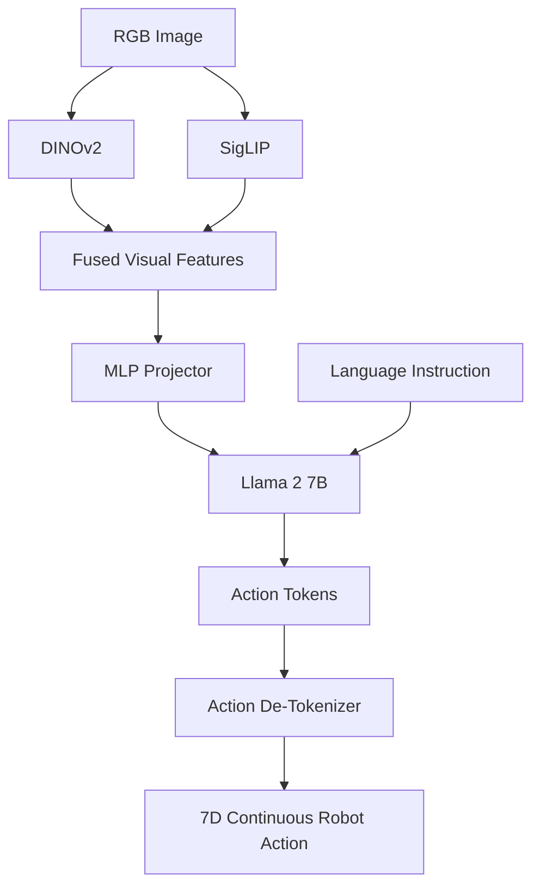
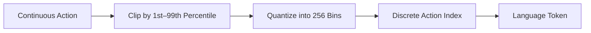
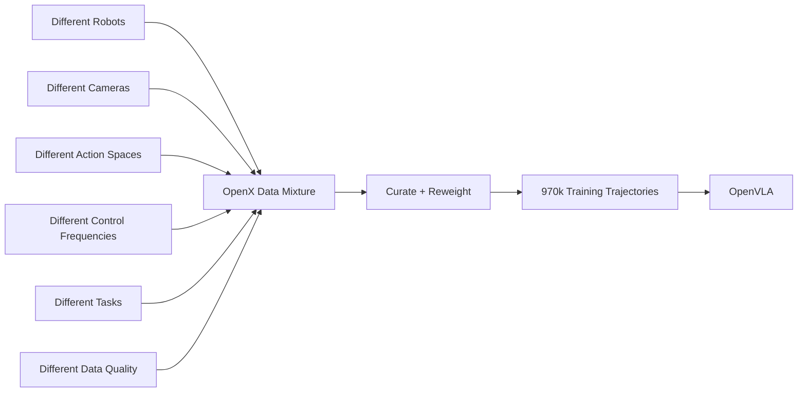
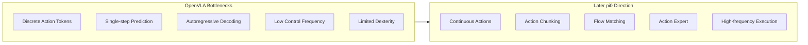
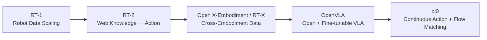

> **Paper:** Moo Jin Kim et al., *OpenVLA: An Open-Source Vision-Language-Action Model*  
> **arXiv:** [2406.09246](https://arxiv.org/abs/2406.09246)  
> **PDF:** [arXiv PDF](https://arxiv.org/pdf/2406.09246)  
> **Project:** [OpenVLA](https://openvla.github.io/)  
> **Code:** [GitHub](https://github.com/openvla/openvla)

如果 RT-2 回答的是：

> **Vision-Language Model 能不能直接输出 Robot Action？**

那么 OpenVLA 继续追问的是：

> **这样的 VLA 能不能真正开放出来，让普通机器人实验室下载、微调并部署到自己的机器人上？**

这就是 OpenVLA 最值得关注的地方。


OpenVLA 并没有推翻 RT-2 的基本思路。相反，它保留了最核心的 **Action Tokenization**，然后把重点转向：

- 开源模型；
- 大规模跨机器人数据；
- 下游任务微调；
- LoRA；
- 量化部署。

所以它是 RT-2 和后续 $\pi_0$ 之间非常自然的一块拼图。

---

## 1. RT-2 到 OpenVLA，真正发生了什么？

先把二者放在一起：

| | RT-2 | OpenVLA |
| --- | --- | --- |
| 时间 | 2023 | 2024 |
| 模型规模 | 12B / 55B | **7B** |
| Backbone | PaLI-X / PaLM-E | **DINOv2 + SigLIP + Llama 2** |
| Action | Discrete Tokens | **Discrete Tokens** |
| Robot Data | RT data / RT-X | **970k OpenX trajectories** |
| 开源 | 否 | **是** |
| 下游 Fine-tuning | 非核心 | **核心问题** |
| LoRA / Quantization | 非核心 | **系统研究** |

因此 OpenVLA 的主要贡献并不是：

> 提出一种全新的 VLA 架构。

而更接近：

> **把 RT-2 已经证明有效的 VLA 范式，做成一个开放、可适配的 Robot Foundation Model。**

---

## 2. 一张图看懂 OpenVLA


*OpenVLA 模型结构。图片来自 arXiv HTML 版论文 Figure 1。*

如果把论文原图抽象一下，整个网络其实非常清楚：



OpenVLA 建立在 **Prismatic-7B VLM** 上，主要由三个部分组成：

1. **DINOv2 + SigLIP 双视觉编码器**
2. **MLP Projector**
3. **Llama 2 7B**

为什么同时使用 DINOv2 和 SigLIP？

可以粗略理解为：

- **SigLIP** 更擅长语义层面的视觉—语言对齐；
- **DINOv2** 保留更丰富的空间和低层视觉信息。

对于机器人来说，只知道：

> “这是一个杯子。”

还不够。

策略还需要判断：

> “杯子具体在哪里？机械臂应该朝哪个方向移动？”

因此 OpenVLA 希望视觉表示同时包含：


这是它相比单一视觉编码器很重要的设计。

---

## 3. OpenVLA 仍然把 Action 当成 Language Token

这是 OpenVLA 和 RT-2 最直接的继承关系。

典型机器人动作可以写成一个 7 维向量：

```text
Δx, Δy, Δz,
Δroll, Δpitch, Δyaw,
gripper
```

这些值本来都是连续量。

OpenVLA 不直接做连续回归，而是对每一个动作维度进行离散化：



也就是说，对于某个动作维度：

$$
a_i \in \mathbb{R}
$$

会被映射为：

$$
\hat a_i \in \{0,\ldots,255\}.
$$

这里有一个很实用的细节。

OpenVLA 没有简单使用动作数据的绝对 `min/max`，而是采用：

> **1st percentile 到 99th percentile**

作为主要离散范围。

原因是机器人数据中可能存在少量极端动作。如果直接使用最大值和最小值，256 个 bin 会被少数 outlier 拉得很宽，反而降低常见动作区域的分辨率。

---

## 4. Action Token 从哪里来？

OpenVLA 使用 Llama 2 tokenizer。

但机器人需要大约：

```text
256 Action Tokens
```

作者采用了一个非常直接的方案：


于是训练时仍然可以使用标准语言模型的 **Next-Token Prediction**。

对于模型而言：

```text
Image + "put eggplant in bowl"
```

经过 Llama 2 后输出的不是自然语言：

```text
"The robot should move left..."
```

而是类似：

```text
[action_132] [action_87] [action_201] ...
```

这些 Token 再经过 de-tokenization 恢复成连续机器人控制量。

因此 OpenVLA 本质上仍然是：

> **把机器人控制问题重新写成语言模型的 Token Prediction 问题。**

这正是 RT-2 建立的 VLA 范式。

---

## 5. 真正让 OpenVLA 强起来的是 970k Robot Trajectories

OpenVLA 的另一个核心是 **Open X-Embodiment**。

论文最终整理了约：

```text
970k robot trajectories
```

用于训练。

问题在于，不同机器人数据天然是异构的：



所以 Robot Foundation Model 的问题已经不再只是：

> “数据够不够多？”

而是：

> **不同 embodiment、任务、相机和控制空间的数据，怎样组成一个有效的训练分布？**

OpenVLA 对 OpenX 数据进行了筛选和重新加权，更偏好多样性较高的数据，降低重复性较强的数据权重。

这也是后续跨 embodiment VLA 非常重要的一条经验。

---

## 6. OpenVLA 的训练方式其实很像 LLM Fine-tuning

OpenVLA 并不是从零训练一个 7B 模型。

它的训练路径非常直接：


论文训练规模大致为：

```text
7B parameters
970k trajectories
27 epochs
64 × A100
≈ 2 weeks
```

一个很有意思的现象是：

> **机器人数据可以被重复训练很多个 epoch，而真实性能仍然继续提升。**

作者最终训练约 27 epochs，直到 Action Token Accuracy 超过 95%。

这说明虽然 OpenVLA 使用的是语言模型形式的 Token Objective，但机器人 imitation learning 和互联网语言预训练的数据统计性质仍然非常不同。

---

## 7. 实验：OpenVLA 到底比 RT-2-X 强在哪里？

论文在多个真实机器人平台上进行评估。


*OpenVLA 与 RT-1-X、Octo、RT-2-X 的真实机器人泛化对比。图片来自 arXiv HTML 版论文 Figure 2。*

在 BridgeData V2 WidowX 测试中：

| Model | Average Success |
| --- | ---: |
| RT-1-X | 18.5% |
| Octo | 20.0% |
| RT-2-X | 50.6% |
| **OpenVLA** | **70.6%** |

分不同泛化维度看：

| Generalization | RT-2-X | OpenVLA |
| --- | ---: | ---: |
| Visual | 52.0% | **87.0%** |
| Motion | 55.0% | **60.0%** |
| Physical | 26.7% | **76.7%** |
| Semantic | **38.8%** | 36.3% |
| Language Grounding | 85.0% | **90.0%** |

这里最值得关注的反而不是 OpenVLA 全面领先。

因为：

> **Semantic Generalization 上 RT-2-X 仍然略强。**

为什么？

RT-2-X 在训练机器人动作时继续混入互联网 Vision-Language Data，也就是 **Co-Fine-Tuning**。

而 OpenVLA 的路径更接近：


因此 OpenVLA 在机器人 Fine-tuning 后可能遗忘一部分原本的 Web Knowledge。

这与 RT-2 中的结论正好对应：

> **Co-Fine-Tuning 的一个重要作用，就是防止机器人训练把预训练语义知识冲掉。**

---

## 8. OpenVLA 真正重要的贡献：Fine-tuning

如果你自己有一台 Franka，真正关心的问题通常不是：

> OpenVLA 在作者实验室跑多少分？

而是：

> **我采几十条 demonstration，能不能让它学会我的任务？**

OpenVLA 专门研究了这个问题。

作者在新的 Franka setup 上使用：

```text
10–150 demonstrations
```

进行下游 Fine-tuning，并和：

- Diffusion Policy
- Octo
- OpenVLA from scratch
- pretrained OpenVLA

进行比较。

结果有一个很重要的规律：

### Narrow Single-task

例如：

```text
put carrot in bowl
```

这种非常窄、非常强调动作精度的任务，Diffusion Policy 依然很强。

### Multi-task + Language Grounding

当环境开始包含：

- 多个物体；
- 多种语言指令；
- 需要根据语言选择目标；

OpenVLA 的优势会更加明显。

因此可以这样理解：

> **VLA 的优势不是一定体现在最窄的单技能控制，而是在任务分布、语言条件和物体组合逐渐复杂后出现。**

---

## 9. LoRA：VLA 开始真正进入普通机器人实验室

Full Fine-tuning 一个 7B 模型依然很贵。

论文因此系统测试了参数高效微调。

| Method | Success | Trainable Params |
| --- | ---: | ---: |
| Full Fine-tuning | 69.7% | 7.19B |
| Last Layer | 30.3% | 465M |
| Frozen Vision | 47.0% | 6.76B |
| Sandwich | 62.1% | 914M |
| **LoRA r=32** | **68.2%** | **97.6M** |

LoRA rank 32 只训练约：

```text
1.4% parameters
```

却基本追平 Full Fine-tuning。

于是一个普通实验室第一次可以形成非常现实的工作流：


这可能比某一个 benchmark 数字更重要。

因为 VLA 从：

> **大型实验室里的展示模型**

开始变成：

> **机器人研究者真正可以拿来二次开发的基础模型。**

---

## 10. Quantization：机器人模型不能只看模型大小

OpenVLA 原始 bfloat16 推理需要大约：

```text
15–17 GB VRAM
```

在 RTX 4090 上大约可以达到：

```text
6 Hz
```

作者又测试了 bfloat16、int8 和 int4。

| Precision | Success | VRAM |
| --- | ---: | ---: |
| bfloat16 | 71.3% | 16.8 GB |
| int8 | 58.1% | 10.2 GB |
| **int4** | **71.9%** | **7.0 GB** |

一个很有意思的结果是：

> **int8 反而明显变差。**

论文分析认为，一个关键因素并不是数值精度本身，而是量化实现导致推理速度变化，进而改变了机器人实际控制频率。

这暴露了 Robot Policy 和普通 LLM 的本质区别：


所以对于机器人而言：

> **Inference Latency 本身就是 Policy Performance 的一部分。**

---

## 11. OpenVLA 的局限，几乎直接指向了后来的 $\pi_0$

这是这篇论文最值得和 $\pi_0$ 连起来读的地方。

OpenVLA 仍然存在几个非常明确的限制：

- 主要使用单帧 RGB；
- 缺乏更丰富的 observation history；
- proprioception 使用有限；
- 基本是 single-step action prediction；
- Action Token 自回归生成；
- RTX 4090 上约 6 Hz；
- 对高频 dexterous control 仍然有限。

把这些问题放在一起，会得到非常自然的下一步：



这也是为什么 $\pi_0$ 的 Action Expert、Flow Matching 和 Action Chunking 并不是突然出现的。

它们实际上是在回答 OpenVLA 已经暴露出来的问题：

> **当 VLA 已经能够理解视觉和语言以后，我们还应该继续像生成文字一样，一步一步生成机器人动作吗？**

---

## 12. 把 OpenVLA 放回 VLA 的发展主线

现在这几篇论文的关系就非常清楚了：



对应的问题分别是：

| Paper | 最核心的问题 |
| --- | --- |
| RT-1 | 一个 Transformer 能否学习大量机器人任务？ |
| RT-2 | Web Knowledge 能否迁移到 Robot Action？ |
| Open X-Embodiment / RT-X | Robot Data 能否跨 embodiment 扩展？ |
| **OpenVLA** | **VLA 能否开放、可微调、可部署？** |
| $\pi_0$ | 连续高频灵巧控制应该怎样建模？ |

所以我更愿意把 OpenVLA 的位置总结成：

> **RT-2 证明了 VLA；OpenVLA 把 VLA 变成了开放的研究基础设施；$\pi_0$ 开始重新设计 VLA 的 Action Generation。**

---

## 最后，用一句话理解 OpenVLA

RT-2 告诉我们：

> **Vision-Language Model 可以通过 Action Token 直接变成 Robot Policy。**

OpenVLA 进一步证明：

> **这种 VLA 可以建立在开放 VLM 和 Open X-Embodiment 上，并通过标准的 Fine-tuning、LoRA 和 Quantization 工具链适配到新的机器人和任务。**

但它也留下了一个非常关键的问题：

> **离散、自回归、单步 Action Token，真的是机器人动作最合适的表示方式吗？**

这个问题，正好把阅读路线自然地引向后面的：

$$
\pi_0.
$$
