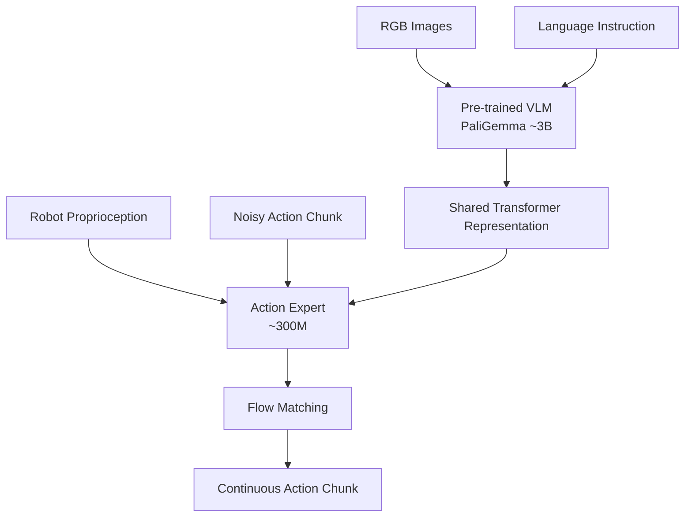
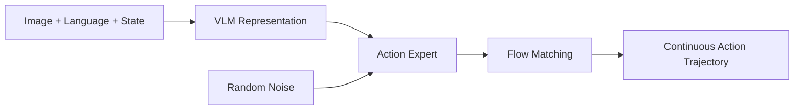
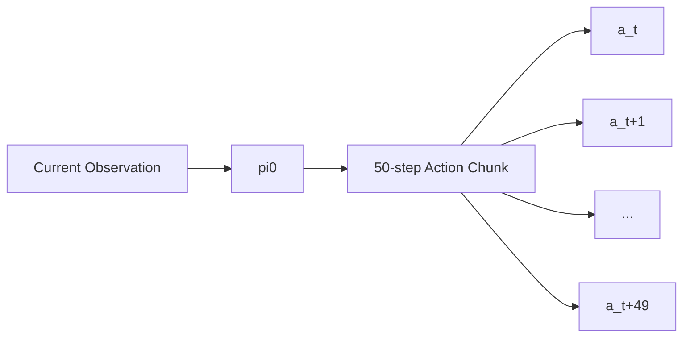
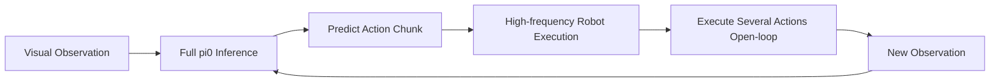
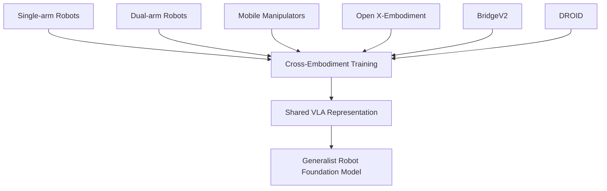
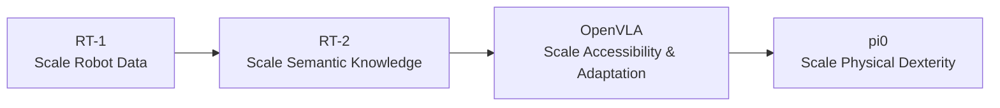

> **Paper:** Kevin Black et al., *$\pi_0$: A Vision-Language-Action Flow Model for General Robot Control*  
> **arXiv:** [2410.24164](https://arxiv.org/abs/2410.24164)  
> **PDF:** [arXiv PDF](https://arxiv.org/pdf/2410.24164)  
> **Project:** [Physical Intelligence — $\pi_0$](https://www.pi.website/blog/pi0)

前面读完 RT-2 和 OpenVLA 后，VLA 的基本范式已经很清楚：

> **把视觉、语言和机器人动作放进一个统一模型，让模型根据 Image + Instruction 直接产生 Action。**

RT-2 证明了这个方向可行；OpenVLA 又把它变成了一个开放、可微调的 7B VLA。

但它们都留下了一个非常现实的问题：

> **机器人动作真的应该像文本一样，被离散成 Token，然后一个一个自回归生成吗？**

当任务变成折衣服、整理桌面、双臂协作、柔性物体操作，以及 20–50 Hz 的高频控制时，动作本质上仍然是连续轨迹。

$\pi_0$ 的核心就是重新思考这一点。

这条演进关系可以概括为：RT-2 建立 VLA，OpenVLA 推进开放与适配，而 $\pi_0$ 开始重点解决连续、高频、灵巧的 Action Generation。

所以，如果一句话概括：

> **$\pi_0$ 保留 VLM 负责“理解世界”，但不再强迫机器人动作完全遵循 Language Token 的生成方式，而是加入专门的 Action Expert，用 Flow Matching 生成连续动作序列。**

---

## 1. 从 RT-2 / OpenVLA 到 $\pi_0$，到底变了什么？

先看最核心的区别：

| | RT-2 | OpenVLA | $\pi_0$ |
| --- | --- | --- | --- |
| VLA | ✓ | ✓ | ✓ |
| Backbone | PaLI-X / PaLM-E | DINOv2 + SigLIP + Llama 2 | **PaliGemma** |
| Action Representation | Discrete Token | Discrete Token | **Continuous Action** |
| Action Generation | Autoregressive | Autoregressive | **Flow Matching** |
| Action Chunking | 非核心 | No | **H = 50** |
| Robot-specific Module | 无独立 Expert | 无独立 Expert | **Action Expert** |
| Cross-Embodiment | 有限 | OpenX | **核心训练设计** |
| 高频 Dexterity | 有限 | 有限 | **核心目标** |

这三篇论文的研究重点其实在不断移动：

因此，$\pi_0$ 并不是简单扩大 OpenVLA，而是把研究重点从“开放 VLA”进一步推进到“连续动作生成与物理灵巧性”。

因此 $\pi_0$ 并不是“把 OpenVLA 再做大一点”。

恰恰相反，它开始重新设计 VLA 中 **Action Generation** 这一半。

---

## 2. 一张论文图看懂 $\pi_0$


*$\pi_0$ 的整体结构。图片来自 arXiv HTML 版论文 Figure 3。*

输入主要包括：

- RGB Images；
- Language Instruction；
- Robot Proprioception。

模型则可以理解为两个主要部分：



整个模型大约 **3.3B 参数**：

```text
PaliGemma VLM   ≈ 3B
Action Expert   ≈ 300M
```

这里最重要的不是参数量，而是职责发生了分工。

### VLM Backbone

主要负责：

- 视觉理解；
- 语言理解；
- 物体与语义关系；
- 任务条件。

### Action Expert

主要负责：

> **在机器人状态与 VLM 语义表示条件下，生成真正适合物理执行的连续动作。**

这和 RT-2 / OpenVLA 有一个非常重要的区别：

> **Language 和 Action 可以共享 Transformer 表示，但不一定必须共享完全相同的输出机制。**

---

## 3. 核心创新：Flow Matching Action Expert

RT-2 和 OpenVLA 的动作生成可以粗略写成：

RT-2 / OpenVLA 更接近“Image + Language → VLM → Autoregressive Action Tokens → Robot Action”的生成方式。

也就是说：

> 像生成文本一样，自回归地产生离散动作 Token。

$\pi_0$ 则改成：



它不是直接预测一个固定动作，而是学习一个 **velocity field**：

> 怎样把初始随机噪声逐渐运输到真实机器人动作分布。

直观理解就是：

```text
random action noise
        ↓
rough trajectory
        ↓
refined trajectory
        ↓
final robot action chunk
```

论文使用 **10 个 flow integration steps** 来完成推理。

所以 Flow Matching 在这里不是为了生成漂亮图像，而是在解决：

> **连续、多模态、高维机器人动作分布如何被高效建模。**

---

## 4. Action Chunking：一次生成未来 50 个动作

$\pi_0$ 的另一个关键设计是 **Action Chunking**。

传统 single-step policy 更像：

```text
observe → predict one action → execute → observe again
```

而 $\pi_0$ 一次预测：

$$
A_t =
[a_t,a_{t+1},\ldots,a_{t+H-1}],
$$

其中：

$$
H=50.
$$

也就是一次产生最多 **50 个未来动作**。



这意味着模型学习的不再是：

> “下一步往哪动？”

而更接近：

> **“接下来这一小段运动轨迹应该是什么？”**

对于折衣服、双臂协调、拿取柔性物体这类任务，这种 trajectory-level prediction 比单步动作自然得多。

---

## 5. 50 Hz 并不意味着 3.3B 模型每秒完整推理 50 次

这是论文中非常容易被误读的一点。

$\pi_0$ 支持最高约：

```text
50 Hz robot control
```

但不等于：

```text
50 × full VLA inference / second
```

对于 50 Hz 的机器人，论文采用的方式大致是：

```text
每 0.5 秒重新 inference
→ 执行约 25 个 action
→ 再重新 inference
```

对于 20 Hz 的 UR5e / Franka：

```text
每 0.8 秒 inference
→ 执行约 16 个 action
```

RTX 4090 上论文报告的一次完整推理约为：

```text
Image encoder       14 ms
Observation pass    32 ms
10 × Flow steps     27 ms
-------------------------
On-board total      73 ms
```

所以真正的机制是：



换句话说：

> **低频生成一小段未来轨迹，高频执行这段轨迹。**

这也是 Action Chunking 为什么重要。

---

## 6. Action Chunking 的代价：Closed-loop Feedback 变少

Action Chunk 越长，效率越高。

但执行 chunk 中间的动作时，模型不会每一步都重新观察环境。

于是存在天然的 trade-off：

这个 trade-off 可以直接理解为：

| Chunk | 优点 | 代价 |
| --- | --- | --- |
| Larger chunk | 执行效率更高 | 视觉反馈更稀疏 |
| Smaller chunk | Closed-loop 更强 | 推理开销更大 |

这也是为什么 Action Chunking 并不是简单的“越长越好”。

在高度动态环境里，如果外界发生变化，而机器人仍然 open-loop 执行旧的 chunk，就可能产生误差。

因此这里其实留下了一个后续非常重要的问题：

> **如何同时获得高频执行与高频视觉反馈？**

---

## 7. Cross-Embodiment：一个模型学习多种机器人

$\pi_0$ 的第二条大主线不是 Flow Matching，而是 **Robot Data Scaling**。

论文自己的数据覆盖：

```text
7 robot configurations
68 broad tasks
```

包括：

```text
UR5e
Franka
Bimanual UR5e
Bimanual Trossen
Bimanual ARX / AgileX
Mobile Trossen / ARX
Mobile Fibocom
```

同时又混入 Open X-Embodiment、BridgeV2、DROID 等开放机器人数据。

论文报告整个研究使用超过：

```text
10,000 hours
```

的机器人数据，其自有数据约有：

```text
903M timesteps
```

因此训练目标已经不只是：

> “让一台机械臂学会很多任务。”

而是：

> **让一个模型吸收不同 embodiment 的物理经验。**



不同机器人 action space 并不一样。

$\pi_0$ 使用一个很工程化但有效的方法：

> **把 state/action vector 统一 padding 到最大 18 维。**

缺少的维度补零；缺少的 camera slot 使用 mask。

这看起来不“炫”，但对于 Robot Foundation Model 来说非常关键：

> **统一数据接口往往和模型结构本身一样重要。**

---

## 8. Pre-training + Post-training：机器人开始复制 LLM 的训练范式

$\pi_0$ 还进一步采用了很明显的 Foundation Model Training Recipe：


### Pre-training

目标是覆盖尽可能多的：

- robots；
- objects；
- tasks；
- failures；
- recovery behaviors。

这里的数据可以非常多样，甚至质量不完全一致。

它主要回答：

> **What can the robot do?**

### Post-training

再使用质量更高、更一致的数据，对具体任务进行专项训练。

例如：

- laundry folding；
- table bussing；
- box assembly。

它回答的是：

> **How can the robot do this task well?**

这和现代 LLM：

```text
Pre-training → Post-training
```

的思路已经非常接近。

---

## 9. 实验：完整 $\pi_0$ 到底强在哪里？

论文首先进行 **Out-of-Box** 测试，也就是不针对测试任务专门 post-train。


*$\pi_0$、$\pi_0$-small、OpenVLA 和 Octo 的直接提示实验。图片来自 arXiv HTML 版论文 Figure 7。*

测试包括：

- Shirt Folding；
- Bussing Easy；
- Bussing Hard；
- Grocery Bagging；
- Toast out of Toaster。

完整 $\pi_0$ 的 normalized task progress 大约为：

| Task | $\pi_0$ |
| --- | ---: |
| Shirt Folding | **1.000** |
| Bussing Easy | **0.971** |
| Bussing Hard | **0.875** |
| Grocery Bagging | **0.786** |
| Toast out of Toaster | **0.750** |

几个 baseline 很有代表性：

### OpenVLA

```text
Large VLA
+
Discrete autoregressive actions
```

### Octo

```text
Robot Foundation Model
+
Diffusion action generation
```

### $\pi_0$-small

```text
Continuous-action architecture
+
No large VLM initialization
```

所以这个实验真正说明的不是：

> **Flow Matching 单独解决了所有问题。**

而是：

> **VLM semantic prior + large robot data + cross-embodiment training + continuous action generation 需要组合在一起。**

---

## 10. $\pi_0$ 真正提升的是 Physical Dexterity

RT-2 更强调：

> **Semantic Generalization**

比如：

```text
What object can be used as a hammer?
```

模型需要理解物体、语义与常识，再把它 Ground 到机器人动作。

而 $\pi_0$ 更强调：

> **Physical Dexterity**

例如：

- fold crumpled clothes；
- stack dishes；
- manipulate deformable objects；
- use two arms simultaneously；
- recover from manipulation errors。

所以可以粗略理解：

因此可以粗略理解为：RT-2 / OpenVLA 更突出 **semantic understanding → action**，而 $\pi_0$ 进一步强调 **semantic representation → continuous action distribution → physical dexterity**。

因此：

> **RT-2 更突出“机器人应该做什么”，$\pi_0$ 开始更认真地解决“机器人具体应该怎么动”。**

两者当然不是完全割裂，但这个视角非常适合快速理解技术演进。

---

## 11. $\pi_0$ 仍然没有彻底解决 Long-Horizon Planning

$\pi_0$ 展示了很多长时间任务：

- laundry folding；
- table bussing；
- box assembly；
- dryer unloading。

部分任务甚至持续：

```text
5–20 minutes
```

但这里必须区分：

```text
Low-level Dexterous Policy
```

和：

```text
High-level Task Planning
```

在部分复杂任务中，论文仍然使用一个高层 VLM 产生中间语言指令：

在这种设置下，高层 VLM 负责把 `"bus the table"` 分解成 `"pick up the napkin"` 等子任务，再由 $\pi_0$ 把子任务转成连续机器人动作。

所以不能简单理解成：

> “一个 $\pi_0$ 网络已经独立解决了 20 分钟 Long-Horizon Planning。”

更准确的是：

> **$\pi_0$ 显著提升了通用低层策略的灵巧性，但高层任务分解在部分设置中仍然依赖单独的 VLM。**

---

## 12. 从 RT-1 到 OpenVLA，再到 $\pi_0$

现在把这几篇论文放在一起，路线就非常清楚：



对应的问题分别是：

| Paper | 核心问题 |
| --- | --- |
| RT-1 | 一个 Transformer 能否学习大量机器人任务？ |
| RT-2 | Web Knowledge 能否迁移到 Robot Action？ |
| OpenVLA | VLA 能否开放、微调并部署？ |
| **$\pi_0$** | **VLA 如何产生连续、高频、灵巧的机器人动作？** |

这样再看 $\pi_0$ 的几个设计，就非常自然：

```text
Action Expert
Flow Matching
Action Chunking
Cross-Embodiment Training
Pre-training + Post-training
```

它们都在回答同一个问题：

> **一个真正的 Robot Foundation Model，除了“看懂”和“听懂”，还需要怎样学会“动得好”？**

---

## 13. 我认为 $\pi_0$ 真正重要在哪里？

如果只把 $\pi_0$ 理解成：

> **“把 Diffusion 换成 Flow Matching 的 VLA。”**

其实低估了这篇论文。

它真正重要的是把此前几个方向组合到同一个 Robot Foundation Model 中：

从系统角度看，$\pi_0$ 把 Internet-pretrained VLM、Cross-Embodiment Robot Data、Action Expert、Flow Matching、Action Chunking 与 Pre-training/Post-training 组合成了一套更完整的 Robot Foundation Model recipe。

所以 $\pi_0$ 的贡献并不只是某一个模块。

它更像是在回答：

> **Robot Foundation Model 到底应该由哪些部分组成？**

RT-2 建立了：

```text
Vision + Language → Action
```

OpenVLA 让这个接口变得开放、可微调。

而 $\pi_0$ 开始重新设计：

- Action Representation；
- Action Generation；
- Robot Data Scaling；
- Embodiment Scaling；
- Training Recipe；
- Dexterity。

---

## 最后，用一句话理解 $\pi_0$

RT-2 告诉我们：

> **预训练 VLM 可以被 Ground 到 Robot Action。**

OpenVLA 告诉我们：

> **VLA 可以成为开放、可适配的机器人基础模型。**

$\pi_0$ 则进一步告诉我们：

> **机器人动作并不一定要完全按照 Language Token 的方式生成；可以保留 VLM 负责语义理解，再使用专门的 Action Expert 和 Flow Matching 生成连续 Action Chunk。**

因此这条路线可以记成：

```text
RT-1      → Robot Data
RT-2      → Semantic Knowledge
OpenVLA   → Accessibility & Adaptation
pi0       → Physical Dexterity
```

而 $\pi_0$ 留下的下一道问题也非常自然：

> **如何把更强的 reasoning、long-horizon planning、实时 closed-loop feedback 和更大规模机器人数据继续整合进同一个 VLA？**
