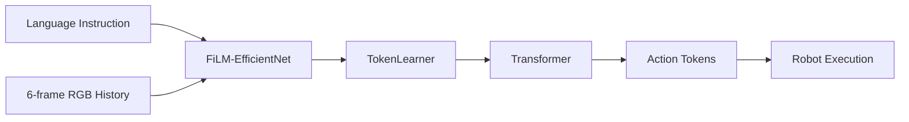
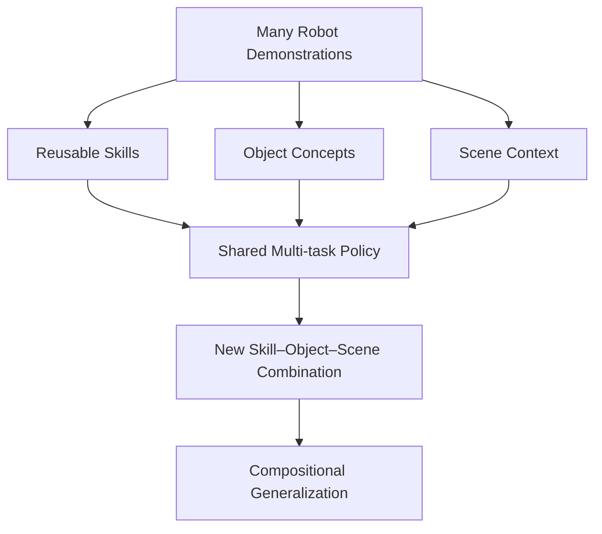
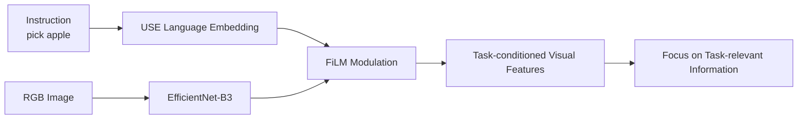
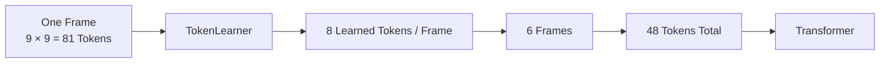
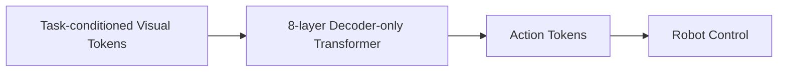
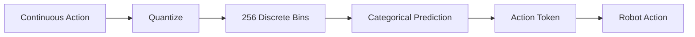
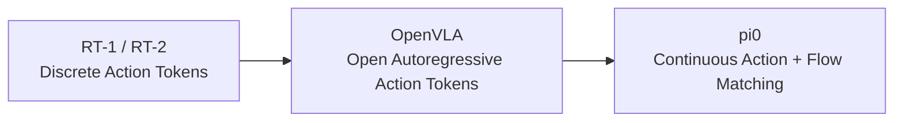
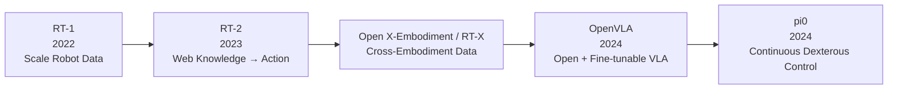
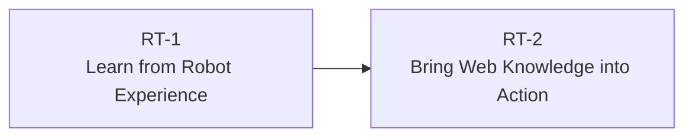

> **Paper:** Anthony Brohan et al., *RT-1: Robotics Transformer for Real-World Control at Scale*  
> **arXiv:** [2212.06817](https://arxiv.org/abs/2212.06817)  
> **PDF:** [arXiv PDF](https://arxiv.org/pdf/2212.06817)  
> **Project:** [RT-1 Project Page](https://robotics-transformer1.github.io/)  
> **Code:** [google-research/robotics_transformer](https://github.com/google-research/robotics_transformer)

RT-1 是一篇非常适合作为 **Robot Foundation Model / Vision-Language-Action（VLA）** 入门的论文。

如果只用一句话概括：

> **RT-1 用大规模、多任务的真实机器人示范数据训练一个语言条件 Transformer，让同一个策略直接从图像和自然语言指令预测机器人动作。**

它真正重要的地方并不是“Transformer 也可以控制机器人”，而是开始验证一个更大的问题：

> **机器人策略能不能像大语言模型一样，通过更大的数据规模、更高的任务多样性和足够强的模型容量，获得更好的泛化能力？**


*RT-1 的整体目标：从大规模真实机器人数据中学习一个可以泛化到新任务、新物体和新场景的统一策略。图片来自 RT-1 官方项目页。*

---

## 1. RT-1 到底在做什么？

RT-1 学习的是一个端到端机器人策略。

输入主要包括：

- 最近 **6 帧 RGB 图像**；
- 一条自然语言指令，例如 `pick apple`、`open the drawer`。

输出是机器人当前应该执行的动作，包括机械臂位姿变化、夹爪开合、移动底盘动作和任务终止信号。

整个过程可以概括为：



RT-1 没有显式地图，没有单独的路径规划器，也不像 Dreamer 一样先学习世界模型再 imagined rollout。

它做的事情很直接：

> **根据当前看到的图像和任务指令，直接预测下一步动作。**

---

## 2. RT-1 最核心的东西其实是数据

RT-1 使用 **13 台真实机器人**，持续约 **17 个月**收集数据，最终得到约 **13 万条真实机器人 episode**，覆盖 **700+ 个任务**。

这些任务包括：

```text
pick object
place object
open / close drawer
move object near another object
put object into drawer
knock object over
...
```

真正值得关注的不是“700”这个数字，而是：

> **这些任务之间存在大量可以复用的行为结构。**

例如训练数据中可能出现：

```text
pick coke can
pick apple
move apple near bottle
```

模型反复看到的是不同的：

```text
skill + object + scene
```

组合。

因此测试时，即使某条完整指令没有在训练集中出现，模型仍然可能重新组合已经学过的 skill、object 和 scene。

这个过程可以这样理解：



所以 RT-1 并不是希望机器人“记住 700 个任务”。

它真正想验证的是：

> **一个统一策略能否从大量任务中学习到可以跨任务复用的行为表示。**

---

## 3. 模型结构：其实只需要理解四步

RT-1 约有 **35M 参数**，并且需要在真实机器人上以大约 **3 Hz** 的频率进行闭环控制。

因此它不是简单堆一个更大的 Transformer，而是在：

> **模型容量 ↔ 实时推理速度**

之间做平衡。

完整结构如下：


*RT-1 的模型结构：语言指令通过 USE 编码，并通过 FiLM 调制 EfficientNet；视觉特征经 TokenLearner 压缩后送入 Transformer，最终输出离散动作 token。图片来自 Google Research 官方博客。*

---

### 3.1 Language → Universal Sentence Encoder

自然语言指令首先经过预训练的 **Universal Sentence Encoder（USE）**，得到语言 embedding。

RT-1 并没有依靠机器人数据从零学习语言，而是直接利用已经训练好的语言语义表示。

---

### 3.2 FiLM-EfficientNet：让视觉特征被任务条件化

每帧 RGB 图像经过 ImageNet 预训练的 **EfficientNet-B3**。

这里真正关键的是 **FiLM**。

语言 embedding 会直接调制 EfficientNet 中间的视觉特征：



因此 RT-1 并不是：

```text
先看图 → 最后再拼语言
```

而是一种明显的 **early language fusion**。

视觉编码过程本身就已经被当前任务条件化。

---

### 3.3 TokenLearner：81 → 8

EfficientNet 最终得到一个：

$$
9\times9\times512
$$

的空间特征图。

展平以后，每帧有：

$$
9\times9=81
$$

个视觉 token。

RT-1 一次输入 6 帧，因此如果不压缩：

$$
6\times81=486
$$

个 token 会全部进入 Transformer。

为满足实时控制要求，RT-1 使用 **TokenLearner**，把每帧：

$$
81\rightarrow8.
$$

于是最终：

$$
6\times8=48
$$

个视觉 token 进入 Transformer。



这一步非常关键。

TokenLearner 不是简单 resize 或 average pooling，而是学习：

> **当前任务中哪些视觉信息最值得保留。**

所以它同时解决了两个问题：

- 保留任务相关视觉信息；
- 显著降低 Transformer 计算量。

---

### 3.4 Transformer → Action

最后，48 个视觉—语言 token 被送入一个 **8 层 decoder-only Transformer**。

Transformer 输出的不是文本，而是机器人动作。

因此 RT-1 本质上把机器人控制重新写成：



这就是 **Robotics Transformer** 这个名字最直接的含义：

> **把 Robot Policy 看成一个序列建模问题。**

---

## 4. 为什么要把机器人动作也变成 Token？

这是 RT-1 中非常值得记住的设计。

机器人机械臂和移动底盘本来都是连续控制量，但 RT-1 没有直接进行连续值回归，而是把每一个连续动作维度划分为：

```text
256 bins
```

整个过程可以写成：



为什么这样设计？

一个重要原因是机器人示范数据具有明显的 **multi-modality**。

例如抓取同一个物体：

- 可以从左边接近；
- 可以从右边接近；
- 可以采用不同末端执行器姿态。

这些动作都可能是合理的。

如果使用简单的 Gaussian 去拟合连续动作，模型可能预测多个合理动作之间的“平均值”，而这个平均值反而可能不是一个好动作。

离散 categorical distribution 则可以更自然地表达多个可能的动作模式。

论文消融也显示，替换成连续动作输出后性能明显下降。

所以 RT-1 给出了一个后续 VLA 一直在讨论的问题：

> **Action Representation 并不是实现细节，而是会直接决定机器人策略能够表达怎样的行为分布。**

这条线后来会继续演化：



---

## 5. 实验结果：重点看泛化，而不是 Seen Task

论文在真实机器人上进行了超过 **3000 次 rollout**，主要测试：

- **Seen Tasks**：训练中出现过；
- **Unseen Tasks**：新的任务组合；
- **Distractors**：加入额外干扰物；
- **Backgrounds**：改变环境背景。

| Model | Seen | Unseen | Distractors | Backgrounds |
| --- | ---: | ---: | ---: | ---: |
| Gato | 65% | 52% | 43% | 35% |
| BC-Z | 72% | 19% | 47% | 41% |
| BC-Z XL | 56% | 43% | 23% | 35% |
| **RT-1** | **97%** | **76%** | **83%** | **59%** |

论文的主要对比如下：


*RT-1 与 Gato、BC-Z 和 BC-Z XL 在 Seen Tasks、Unseen Tasks、Distractors 与 Backgrounds 四类场景中的成功率对比。图片来自 RT-1 官方项目页。*

真正值得看的并不是：

> **Seen = 97%**

而是另外三个结果。

### Unseen Tasks：76%

说明 RT-1 可以一定程度上重新组合训练中学到的技能、物体和任务结构，而不是只记忆完整指令。

### Distractors：83%

说明加入额外无关物体后，策略仍具有较强鲁棒性。

### Backgrounds：59%

这个结果一方面优于基线，另一方面也说明：

> **视觉环境发生较大变化后，RT-1 仍然明显受到 distribution shift 影响。**

所以 RT-1 的泛化更准确地说是：

> **在大规模但仍有限的机器人数据分布附近，获得更好的组合泛化和场景鲁棒性。**

而不是今天所说的完全开放世界泛化。

---

## 6. RT-1 真正重要的不是某一个模块，而是 Scaling 思想

如果只记：

```text
EfficientNet
TokenLearner
8-layer Transformer
256 Action Bins
```

很容易错过这篇论文真正重要的地方。

RT-1 想验证的是：


论文后面还测试了：

- simulation data；
- 另一种 Kuka 机器人数据；
- 与 SayCan 的组合。

这些实验不是理解 RT-1 架构所必需的，但它们共同指向一个很重要的趋势：

> **统一机器人策略可能从不同任务、不同数据源，甚至不同机器人 embodiment 中吸收可迁移知识。**

这就已经开始接近后来 Robot Foundation Model 的基本思想。

---

## 7. 把 RT-1 放回 VLA 的发展路线

从今天回头看 RT-1，会发现它是后续很多 VLA 工作的重要起点。



对应的核心问题也在不断变化：

| Paper | 核心问题 |
| --- | --- |
| **RT-1** | 一个统一策略能否从大规模机器人数据中学习大量任务？ |
| RT-2 | Web Vision-Language Knowledge 能否迁移到 Robot Action？ |
| Open X-Embodiment / RT-X | Robot Data 能否跨 embodiment 扩展？ |
| OpenVLA | VLA 能否开放、微调和部署？ |
| $\pi_0$ | VLA 如何实现连续、高频、灵巧控制？ |

所以 RT-1 的历史位置可以概括成：

> **它把“机器人策略能否随着数据和任务规模一起扩展”这个问题真正摆到了桌面上。**

---

## 最后，用一句话重新理解 RT-1

读完整篇论文以后，我会把 RT-1 概括为：

> **RT-1 的核心不是提出一个特别复杂的机器人网络，而是证明：当真实机器人数据的规模和多样性足够大，并用一个能够有效吸收这些数据的统一 Transformer 策略进行训练时，机器人控制也开始出现类似 Foundation Model 的 scaling 与泛化趋势。**

如果继续沿着这条路线读，下一篇最自然的是 **RT-2**：



RT-1 解决的是：

> **如何从大量机器人经验中学习统一策略？**

RT-2 则进一步追问：

> **能不能把互联网规模的视觉—语言知识，直接带进机器人动作空间？**
