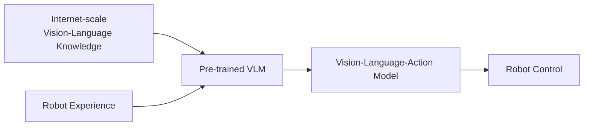
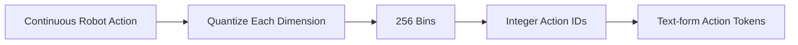
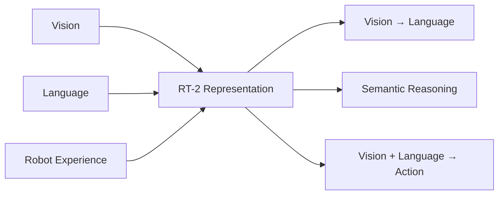
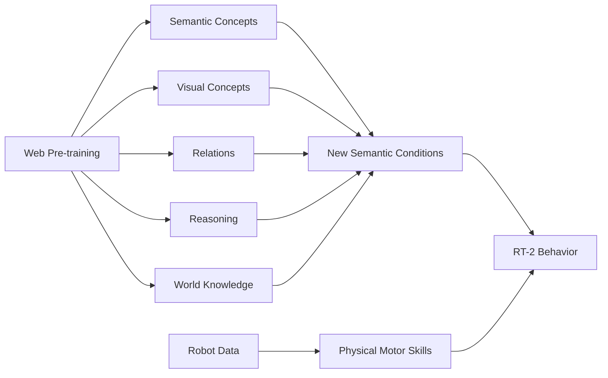
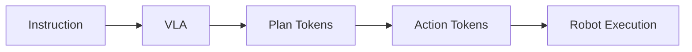
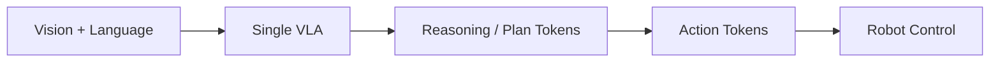
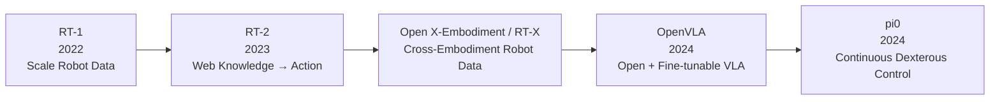
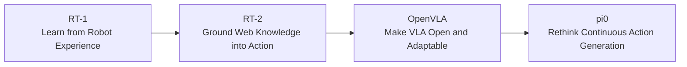

> **Paper:** Anthony Brohan et al., *RT-2: Vision-Language-Action Models Transfer Web Knowledge to Robotic Control*  
> **arXiv:** [2307.15818](https://arxiv.org/abs/2307.15818)  
> **PDF:** [arXiv PDF](https://arxiv.org/pdf/2307.15818)  
> **Project:** [RT-2 Project Page](https://robotics-transformer2.github.io/)  
> **Blog:** [Google DeepMind: RT-2](https://deepmind.google/blog/rt-2-new-model-translates-vision-and-language-into-action/)

如果 RT-1 解决的问题是：

> **能不能用一个统一的 Transformer，从大规模、多任务机器人数据中直接学习机器人策略？**

那么 RT-2 继续追问：

> **能不能把互联网规模的视觉—语言知识，直接迁移到机器人动作空间？**

RT-2 给出的答案非常直接：

> **把机器人动作也表示成 Token，然后让一个预训练 Vision-Language Model 同时学习“回答问题”和“输出机器人动作”。**

这就是论文中提出的 **Vision-Language-Action Model，VLA**。


*RT-2 的核心思路：将互联网视觉语言数据与机器人动作数据共同训练，使预训练 VLM 直接变成可以控制机器人的 VLA。图片来自 RT-2 官方项目页。*

---

## 1. 从 RT-1 到 RT-2，真正发生了什么变化？

RT-1 已经证明：

> **大规模、多任务机器人数据可以训练出一个具有一定泛化能力的统一策略。**

但 RT-1 有一个明显的边界：

> **它知道的世界，基本仍然来自机器人自己见过的数据。**

即使 RT-1 已经收集了 13 台机器人、17 个月、约 13 万条示范，与互联网规模的图像和文本数据相比仍然非常小。

真实机器人很难通过亲自交互覆盖：

- 所有物体；
- 所有环境；
- 所有语言表达；
- 所有语义关系；
- 所有常识。

而大型 Vision-Language Model 已经通过互联网数据学到了大量这些知识。

所以 RT-2 的核心思路变成：



RT-2 不再从头训练一个机器人 Transformer，而是直接从大型预训练 VLM 出发。

论文主要使用：

- **PaLI-X**：5B 和 55B 版本；
- **PaLM-E**：主要使用 12B 版本。

于是 RT-1 和 RT-2 的差别可以简单总结为：

| | RT-1 | RT-2 |
| --- | --- | --- |
| 知识来源 | Robot Data | **Web Data + Robot Data** |
| Backbone | Robot Transformer | **Pre-trained VLM** |
| 输入 | Image + Language | Image + Language |
| 输出 | Action Tokens | **Text-form Action Tokens** |
| 重点 | 多任务 Robot Policy | **Web Knowledge → Robot Action** |
| 核心概念 | Robotics Transformer | **Vision-Language-Action** |

---

## 2. RT-2 最关键的一步：把 Action 当成 Language

理解 RT-2，其实真正需要理解的只有一件事：

> **机器人动作怎样进入 VLM 的输出空间？**

传统 VLM 做的是：

传统 VLM 可以概括为 **Image + Text → VLM → Text Tokens**。

例如：

```text
Q: What is in the image?
A: A red apple.
```

而机器人策略需要：

而机器人策略需要的是 **Robot Image + Instruction → Policy → Robot Action**。

问题就在这里：

> VLM 原本输出的是 **Language Tokens**，而机器人需要的是连续控制量。

RT-2 没有另外设计一个复杂的 Action Head。

它直接把 Robot Action 也编码成 Token。


*RT-2 的动作表示：终止标志、三维位置变化、三维旋转变化和夹爪状态共同组成一个机器人动作。图片来自 RT-2 官方项目页。*

RT-2 延续 RT-1 的动作空间：

```text
Terminate / Continue
Δ Position X
Δ Position Y
Δ Position Z
Δ Rotation X
Δ Rotation Y
Δ Rotation Z
Gripper
```

连续动作维度被离散为 **256 bins**：



一个动作于是可以写成类似：

```text
1 128 91 241 5 101 127 217
```

对于模型来说：

```text
"The object is an apple."
```

和：

```text
"1 128 91 241 5 101 127 217"
```

本质上都变成了同一件事：

> **Next-Token Prediction**

这一步非常关键。

因为一旦 Action 和 Language 共享同一个 Token Interface：

因此，一个关键变化是让 Language 与 Action 共享同一种 Token Interface：VLM 既可以生成文本，也可以生成机器人动作 Token。

原本负责图像理解、视觉问答和语言推理的 VLM，就可以在不重构整个网络的情况下被训练成机器人策略。

这就是 **Vision-Language-Action** 的核心。

---

## 3. Co-Fine-Tuning：学会 Action 的同时不要忘掉 Web Knowledge

如果直接拿一个 VLM，只用机器人数据进行 Fine-tuning，会产生一个问题：

> **模型可能逐渐忘掉预训练阶段从互联网中学到的视觉和语言知识。**

但 RT-2 的目的恰恰是利用这些知识。

因此论文采用 **Co-Fine-Tuning**：

训练后，同一个模型同时保留 Vision→Language、Semantic Reasoning 和 Vision+Language→Action 三类能力。

训练过程中同时存在两类样本。

### 普通 Vision-Language 数据

```text
Image + Question
→ Natural Language Answer
```

### Robot 数据

```text
Robot Image + Instruction
→ Action Tokens
```

因此同一个模型同时保留：



这也是 RT-2 与“拿一个预训练视觉 Encoder 接到 Robot Policy 前面”最大的不同：

> **RT-2 希望保留整个 VLM 已经学到的视觉—语言知识，而不只是借一个视觉特征提取器。**

论文消融结果也很清楚：

| RT-2-PaLI-X | Size | Training | Unseen Average |
| --- | ---: | --- | ---: |
| From scratch | 5B | Robot data | 9% |
| Fine-tuning | 5B | Robot data | 42% |
| **Co-Fine-Tuning** | **5B** | **Web + Robot** | **44%** |
| Fine-tuning | 55B | Robot data | 52% |
| **Co-Fine-Tuning** | **55B** | **Web + Robot** | **63%** |

最值得记住的是三个趋势：

因此，预训练、Co-Fine-Tuning 和模型规模共同决定了 RT-2 的泛化能力。

RT-2 的泛化能力并不是简单来自“更多 Robot Data”，而是开始真正利用 **Foundation Model Knowledge**。

---

## 4. 实验到底证明了什么？

RT-2 做了超过 **6000 次真实机器人 evaluation trials**。

快速精读时不需要看完所有实验，只需要回答两个问题。

### 4.1 基本机器人控制有没有因为换成大 VLM 而变差？

Seen Tasks：

| Model | Seen Tasks |
| --- | ---: |
| RT-1 | 92% |
| RT-2-PaLI-X-55B | 91% |
| RT-2-PaLM-E-12B | 93% |

基本没有。

所以引入大型 VLM 后，RT-2 仍然保持了与 RT-1 接近的机器人控制能力。

### 4.2 Web Knowledge 有没有真正迁移到机器人？

论文重点测试：

```text
Unseen Objects
Unseen Backgrounds
Unseen Environments
```

平均结果：

| Model | Unseen Average |
| --- | ---: |
| R3M | 12% |
| VC-1 | 10% |
| RT-1 | 32% |
| MOO | 35% |
| **RT-2-PaLI-X-55B** | **62%** |
| **RT-2-PaLM-E-12B** | **62%** |

最关键的变化是：

> **Seen Task 几乎没有损失，但 Unseen Average 从 RT-1 的 32% 提升到了 62%。**

可以把 RT-2 的实验结论概括成：

实验上可以把 RT-2 理解为：**Web 预训练提供语义/视觉知识，Robot Data 提供物理技能，两者在同一个 VLA 中结合。**

所以 RT-2 的价值不是：

> “把机器人已经会做的事情做得更准。”

而是：

> **让机器人可以利用 VLM 中已经存在的知识，处理机器人训练数据没有充分覆盖的新物体、新背景和新环境。**

---

## 5. 什么叫 RT-2 的 Emergent Capability？

这是整篇论文最有意思的部分之一。

研究者故意给机器人一些在机器人训练数据中没有直接出现过的语义任务。

例如：

```text
move apple to 3
```

模型必须先理解数字符号，然后把这个理解转成机器人动作。

或者：

```text
move banana to the sum of two plus one
```

这里需要先完成：

```text
2 + 1 = 3
```

然后再把 banana 移到数字 3。

再比如：

```text
pick up the bag about to fall off the table
```

模型不仅要识别 `bag`，还需要理解：

> **哪个 bag 处于“快掉下桌子”的状态？**

论文主要测试：

- **Symbol Understanding**
- **Reasoning**
- **Person Recognition**

结果：

| Model | Emergent Task Average |
| --- | ---: |
| VC-1 | 11% |
| RT-1 | 17% |
| RT-2-PaLM-E-12B | 40% |
| **RT-2-PaLI-X-55B** | **60%** |

但这里必须注意一个非常重要的边界：

> **Web pre-training 并没有让机器人凭空学会新的运动技能。**

真正迁移过来的主要是：



也就是说：

> **RT-2 更像是在把已有的 Robot Skills 应用到过去没见过的语义条件上，而不是从 Web 数据里凭空学会新的 motor skill。**

这个区别非常重要。

---

## 6. Chain-of-Thought 也开始进入机器人控制

RT-2 还尝试把中间的自然语言 `Plan` 和 Action 放在同一个生成序列中。

普通 RT-2：

```text
Instruction → Action
```

加入 Plan 后：



例如：

```text
Instruction:
I need to hammer a nail,
what object from the scene might be useful?

Plan:
rock

Action:
1 129 138 ...
```


*RT-2 将自然语言 Plan 与 Action Token 放在同一个生成序列中，展示了将语义推理和机器人控制统一到同一个自回归模型中的可能性。图片来自 RT-2 官方项目页。*

这和 SayCan 的思路并不一样。

SayCan 更接近：

```text
LLM → High-level Skill Selection → Separate Low-level Policy
```

而 RT-2 尝试的是：



也就是：

> **Reasoning → Planning → Action 开始有可能出现在同一个 token-generation framework 中。**

---

## 7. RT-2 真正重要在哪里？

如果只看网络结构，RT-2 甚至没有特别复杂。

它最核心的操作其实只有：

相比 SayCan 的“LLM 选技能 + 独立低层策略”，RT-2 更进一步尝试把 Reasoning / Plan Tokens 与 Action Tokens 放进同一个生成模型。

但这个接口把两个以前相对分离的世界连接了起来：

RT-2 的方法可以概括为：**Pre-trained VLM + Robot Action Tokens + Web/Robot Co-Fine-Tuning → VLA**。

所以 RT-2 最重要的贡献不是某个 Transformer Block，而是一种范式变化：

> **机器人策略不一定要从头学习整个世界。可以先让 Foundation Model 从互联网中学习视觉、语言和常识，再通过机器人数据把这些知识 Ground 到 Action Space。**

这也是后来 VLA 路线最核心的思想之一。

---

## 8. RT-2 的局限，也直接指向了后续 OpenVLA 和 $\pi_0$

RT-2 并没有解决所有问题。

### 第一，模型非常大

最大的 RT-2-PaLI-X 有：

```text
55B parameters
```

模型需要运行在多 TPU Cloud Service 上，再通过网络给机器人提供推理。

控制频率大约：

```text
55B → 1–3 Hz
5B  → ~5 Hz
```

这暴露出一个非常现实的矛盾：

> **Foundation Model 越大，实时 Robot Control 越困难。**

### 第二，Physical Skill 仍然依赖 Robot Data

RT-2 可以理解：

```text
rock can be used as a hammer
```

但并不意味着它会自动学会一套从未示范过的复杂 hammering motion。

可以把这一边界理解为：

它真正连接的是两个世界：Foundation Model 提供 Vision、Language、World Knowledge 与 Reasoning；Robot Data 则把这些能力 Ground 到 Physical Action 和 Closed-loop Control。

所以 VLM 主要扩展的是：

> **语义与世界知识**

而真正的 physical execution 仍然需要大量 Robot Data。

---

## 9. 把 RT-2 放回 VLA 的技术发展路线

现在可以把 RT-2 放到整个 VLA 演化中来看：



这几篇论文分别在回答不同的问题：

| Paper | 核心问题 |
| --- | --- |
| RT-1 | Robot Policy 能否随着机器人数据和任务规模扩展？ |
| **RT-2** | **Web Knowledge 能否直接 Ground 到 Robot Action？** |
| Open X-Embodiment / RT-X | Robot Data 能否跨 embodiment 扩展？ |
| OpenVLA | VLA 能否开放、微调和部署？ |
| $\pi_0$ | VLA 如何实现连续、高频、灵巧控制？ |

所以从今天回头看，RT-2 的历史位置非常明确：

> **它真正建立了 Vision + Language → Action 这条 VLA 主线。**

---

## 最后，用一句话理解 RT-2

如果 RT-1 的核心是：

> **让 Transformer 从大量机器人经验中学习统一策略。**

那么 RT-2 的核心就是：

> **把 Robot Action 也变成一种 Token，使互联网规模 Vision-Language Pre-training 中获得的语义知识和推理能力，可以直接进入端到端机器人控制。**

可以把这条递进关系记成：



RT-1 让我们看到：

> **Robot Policy 可以开始 scale with robot data。**

RT-2 则进一步告诉我们：

> **机器人真正需要扩大的，不只是 Robot Data，而是能够被 Ground 到 Action 上的整个 Foundation Model Knowledge。**
