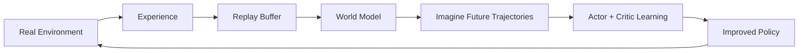
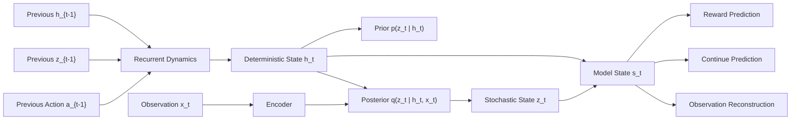
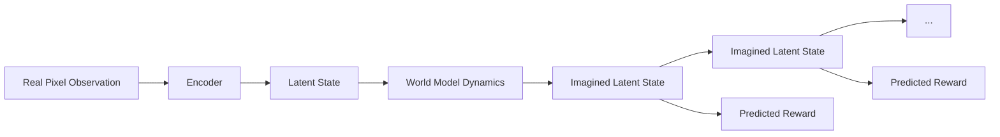
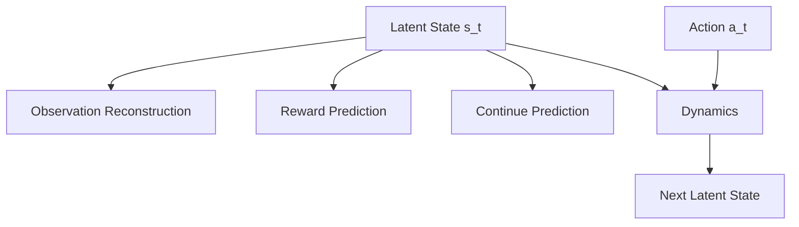
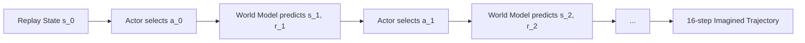
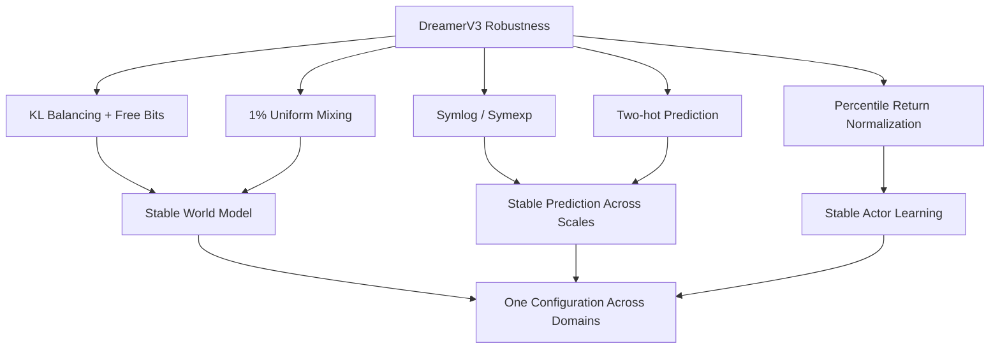
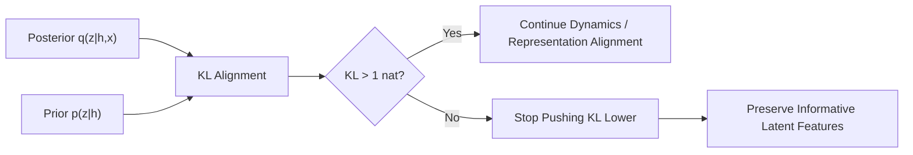
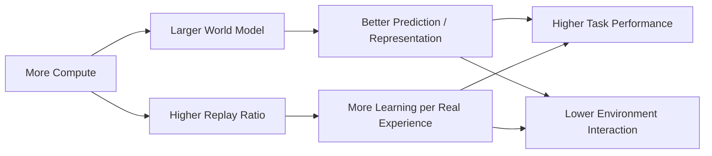
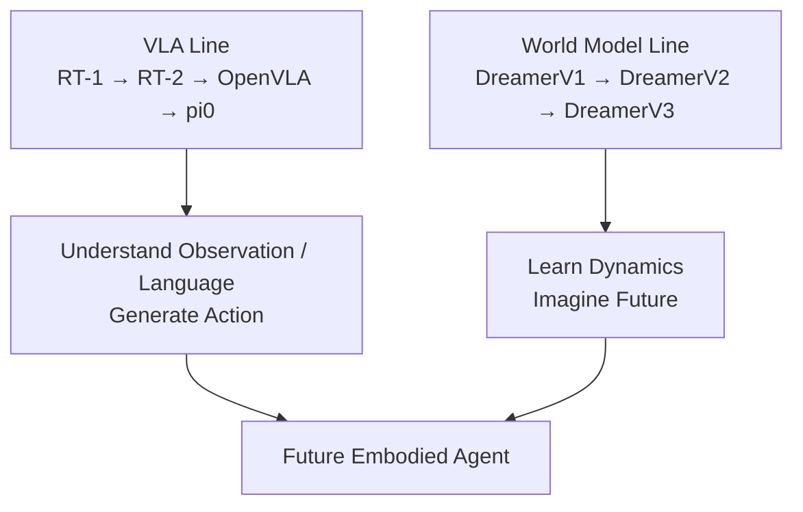

> **Paper:** Danijar Hafner et al., *Mastering diverse control tasks through world models*  
> **Nature:** [Nature 640, 647–653 (2025)](https://www.nature.com/articles/s41586-025-08744-2)  
> **arXiv:** [2301.04104](https://arxiv.org/abs/2301.04104)  
> **Code:** [danijar/dreamerv3](https://github.com/danijar/dreamerv3)

前面读 RT-1、RT-2、OpenVLA 和 $\pi_0$ 时，我们一直在研究一条路线：

> **Observation + Language → Action**

DreamerV3 走的是另一条很重要的路线：

> **Observation + Action → World Model → Imagine Future → Learn Better Action**

它不要求策略只从真实环境交互中直接学习。

相反，DreamerV3 先学习一个环境的 **World Model**，然后让 Actor 和 Critic 在这个学习出来的潜空间世界中反复“想象未来”，再利用 imagined trajectories 学习策略。



如果只用一句话概括 DreamerV3：

> **不要只在真实世界里试错，而是先学会一个可以预测未来的世界模型，再在模型内部大量练习。**

这就是 Dreamer 系列最核心的思想。

---

## 1. DreamerV3 真正想解决什么问题？

强化学习算法往往非常依赖 domain-specific tuning。

例如，同一个算法从：

```text
Atari
```

换到：

```text
Robot Control
```

再换到：

```text
Minecraft
```

经常需要重新调整：

- reward scale；
- learning rate；
- entropy coefficient；
- network size；
- normalization；
- exploration strategy。

DreamerV3 的目标更加激进：

> **能不能使用同一套超参数，在非常不同的任务上直接学习？**

论文最终在 **8 个 domain、150+ 个任务**上使用统一配置，包括：

- Atari；
- Atari100k；
- ProcGen；
- DMLab；
- BSuite；
- Proprio Control；
- Visual Control；
- Minecraft。

这些任务同时包含：

因此 DreamerV3 的难点不是只支持一种 observation/action，而是让同一套算法同时适应离散/连续动作、pixel/vector 输入、dense/sparse reward 和 2D/3D 环境。

所以这篇论文真正强调的不是：

> “DreamerV3 在某一个 benchmark 上拿到最高分。”

而是：

> **一个 Model-Based RL 算法能否在完全不同的环境里保持稳定，而不依赖大量人工调参。**

---

## 2. DreamerV3 的核心：World Model + Actor + Critic

DreamerV3 只有三个核心组件：

三个核心组件的职责很直接：**World Model 预测未来，Critic 评价未来，Actor 选择通向高价值未来的动作。**

### World Model

负责学习：

> **如果当前处于某个状态，并执行某个动作，未来会发生什么？**

### Critic

负责判断：

> **这个 imagined future 到底有多好？**

### Actor

负责选择：

> **怎样行动才能到达价值更高的未来？**

真正关键的是：

> **Actor 和 Critic 的主要训练数据，不是直接来自真实环境，而是来自 World Model 产生的 imagined trajectories。**

这就是 Dreamer 与普通 Model-Free RL 最大的区别。

---

## 3. 一张图看懂 Dreamer 的 World Model


*DreamerV3 的潜空间世界模型。图片来自 arXiv HTML 版论文。*

DreamerV3 使用 **Recurrent State-Space Model（RSSM）**。

它的潜状态不是单一向量，而由两部分组成：

$$
s_t = \{h_t,z_t\}.
$$

其中：

- $h_t$：deterministic recurrent state；
- $z_t$：stochastic discrete state。

可以这样理解：



这里最容易混淆的是 **Prior** 和 **Posterior**。

### Posterior：训练时看到了真实 observation

$$
q_\phi(z_t\mid h_t,x_t)
$$

它可以利用当前真实观测 $x_t$ 推断潜状态。

### Prior：想象未来时看不到真实 observation

$$
p_\phi(z_t\mid h_t)
$$

它只能依靠模型自己的 dynamics 来预测下一个潜状态。

所以训练 World Model 的核心任务之一就是：

> **让 Prior 学会逼近 Posterior。**

这样到了 imagined rollout 阶段，即使没有真实未来图像，模型也能够继续往前预测。

---

## 4. 为什么要在 Latent Space 中想象，而不是直接生成未来视频？

DreamerV3 的 World Model 确实可以重建图像。

论文甚至展示了长时间 open-loop prediction：


*给定前几个 context frames 和后续动作后，World Model 在不再读取真实中间图像的情况下预测后续画面。图片来自 arXiv HTML 版论文。*

但 Dreamer 的真正目的不是：

> **生成好看的未来视频。**

真正用于策略学习的是潜状态：

$$
s_t=\{h_t,z_t\}.
$$

也就是说，策略学习发生在一个紧凑的 latent world 中：



这样做的好处很直接：

- 不需要 Actor 直接处理完整高维图像；
- imagination 不需要每一步都生成真实 pixel；
- 可以在 latent space 中快速 rollout；
- 世界模型可以复用真实经验很多次。

所以 Dreamer 更准确的理解不是：

> “用视频生成模型做 RL。”

而是：

> **学习一个对控制有用的 latent dynamics model，然后在这个 latent dynamics 中训练策略。**

---

## 5. World Model 到底学习什么？

World Model 从状态 $s_t=\{h_t,z_t\}$ 中预测三类关键信息：



分别对应：

### Observation

$$
\hat{x}_t
$$

保证 latent representation 中仍然保留足够的环境信息。

### Reward

$$
\hat r_t
$$

告诉模型 imagined future 中发生的事情是否有价值。

### Continue

$$
\hat c_t
$$

预测 episode 是否继续。

World Model 的总训练目标可以概括成：

$$
\mathcal L_{\text{WM}}
=
\beta_{\text{pred}}\mathcal L_{\text{pred}}
+
\beta_{\text{dyn}}\mathcal L_{\text{dyn}}
+
\beta_{\text{rep}}\mathcal L_{\text{rep}},
$$

论文使用：

$$
\beta_{\text{pred}}=1,\qquad
\beta_{\text{dyn}}=1,\qquad
\beta_{\text{rep}}=0.1.
$$

快速阅读时不用死记公式。

真正需要理解的是：

因此一个 latent state 既要保留足够的信息用于 reconstruction，也要能够预测 reward、episode continuation 和下一时刻 latent state。

模型既不能：

> **只会重建图像，但预测不了未来。**

也不能：

> **未来特别容易预测，但 latent 里面什么有用信息都没有。**

DreamerV3 的很多 robustness design，其实都在解决这个平衡问题。

---

## 6. 最关键的一步：在 World Model 中 Imagine

World Model 学好以后，Dreamer 并不会每次都去真实环境采集新轨迹。

它可以从 Replay Buffer 中取一个真实状态，然后开始：

> **Imagined Rollout**

论文中 imagination horizon 为：

$$
T=16.
$$

整个过程是：



这条 imagined trajectory 包含：

$$
(s_t,a_t,r_t,c_t).
$$

然后：

- Actor 从 imagined states 中选择动作；
- Critic 评估 imagined states 的未来 return；
- 两者都不需要真实 environment step。

所以 Dreamer 的数据利用方式是：

一条真实经验可以被 Replay Buffer 和 World Model 反复利用，进一步产生大量 imagined trajectories 来更新 Actor-Critic。

这正是 Model-Based RL 提升 **sample efficiency** 的基本原因。

---

## 7. Critic：怎样评价 imagined future？

Critic 学习的是 return distribution。

DreamerV3 使用 bootstrapped $\lambda$-return：

$$
R_t^\lambda
=
r_t+
\gamma c_t
\left[
(1-\lambda)v_t
+
\lambda R_{t+1}^{\lambda}
\right].
$$

其中：

$$
\gamma=0.997.
$$

不用死记这个式子。

它表达的核心就是：

> **短期相信 World Model 预测的 reward，长期则逐渐借助 Critic 的 value estimate。**

Critic 将 predicted rewards 与自身的 value estimate 组合成 $\lambda$-return，用有限长度 imagination 近似更长期的未来价值。

因为 imagination horizon 只有 16 steps，不可能直接模拟无限未来。

Critic 的作用就是：

> **在有限 imagination 后面补上长期价值。**

---

## 8. Actor：直接在 imagined trajectory 里学

Actor 的输入同样是：

$$
s_t=\{h_t,z_t\}.
$$

它学习：

$$
a_t\sim\pi_\theta(a_t\mid s_t).
$$

DreamerV3 对连续动作和离散动作统一采用 **REINFORCE estimator**，并加入 entropy regularization。

因此策略学习可以简单理解为：

Actor 直接在 imagined states 上学习动作，并通过 Critic 给出的 return signal 更新策略；DreamerV3 对连续和离散动作统一采用 REINFORCE estimator。

这里一个很漂亮的地方是：

> **同一个 Actor-Critic learning framework 同时支持 continuous 和 discrete action spaces。**

这也是 DreamerV3 能跨很多 domain 使用一套配置的重要基础。

---

## 9. DreamerV3 真正的秘密：不是新架构，而是一整套 Robustness Tricks

如果只知道：

```text
RSSM + Actor-Critic + Imagination
```

其实更像是在理解 Dreamer 系列，而不是 DreamerV3。

DreamerV3 真正解决的是：

> **怎样让这套算法不用针对每个 domain 重新调参？**

论文加入了一整套 robustness techniques：



其中最值得理解的是下面三个。

---

## 10. Symlog：不同任务的数值尺度差太大怎么办？

不同环境中的 observation、reward 和 return 可能差很多个数量级。

直接使用 squared loss 时：

> **大数值 target 会产生非常大的 gradient。**

DreamerV3 使用：

$$
\operatorname{symlog}(x)
=
\operatorname{sign}(x)\ln(|x|+1).
$$

它的逆变换是：

$$
\operatorname{symexp}(x)
=
\operatorname{sign}(x)(e^{|x|}-1).
$$

Symlog 的作用可以直观理解成：

Symlog 会压缩绝对值很大的正负信号，同时在零附近近似恒等映射，因此可以缓解不同 domain 数值尺度差异造成的梯度不稳定。

它有两个重要特点：

- 正负值都可以处理；
- 小数值附近近似 identity，大数值则被 logarithmically compressed。

所以同一套 loss 不容易因为不同 domain 的数值尺度而崩掉。

---

## 11. Two-hot：为什么 Reward 和 Value 不直接做普通回归？

Reward 和 Return 往往：

- noisy；
- multi-modal；
- 跨环境尺度差异巨大。

DreamerV3 没有让 reward head 和 critic 简单输出一个 Gaussian mean。

而是：

> **把连续值投到 exponentially spaced bins 上，再使用 two-hot target。**

例如某个 target 落在两个 bin 中间：

```text
bin_k       target       bin_k+1
  |-----------|-------------|
       0.7          0.3
```

于是 target 不是 one-hot：

```text
[0, 0, 1, 0, ...]
```

而是类似：

```text
[0, 0, 0.7, 0.3, 0, ...]
```

这样最终仍可以恢复连续预测值，但训练变成更稳定的 categorical cross-entropy。

最重要的是：

> **gradient magnitude 不再直接由 target 的绝对数值大小决定。**

这对跨 domain 学习非常重要。

---

## 12. KL Balancing + Free Bits：不要让 Latent Space 崩掉

RSSM 需要让：

$$
p_\phi(z_t\mid h_t)
$$

预测：

$$
q_\phi(z_t\mid h_t,x_t).
$$

但如果 KL regularization 太强，模型可能选择一个非常容易预测、却几乎不包含 observation information 的 latent representation。

DreamerV3 使用 **free bits**：

> 当 KL 已经低于 **1 nat** 时，不再继续强迫它变得更小。



另外 categorical latent 还混入：

```text
99% predicted distribution
+
1% uniform distribution
```

避免概率变成完全 deterministic，从而减少 KL spike。

论文消融显示：

> **KL balancing + free bits 是最重要的一组 robustness techniques。**

---

## 13. Return Normalization：为什么 Actor 能跨不同 Reward Scale？

Actor 中 entropy regularization 的合理权重取决于 reward scale。

例如：

```text
Environment A reward ≈ 1
Environment B reward ≈ 10000
```

如果直接用同一个 entropy coefficient，很难同时适配。

DreamerV3 不使用简单 min/max，而根据 batch 中 return 的：

$$
95\%-5\%
$$

percentile range 估计尺度：

$$
S=
\operatorname{EMA}
\left(
\operatorname{Per}_{95}(R^\lambda)
-
\operatorname{Per}_{5}(R^\lambda)
\right).
$$

直观上：

Return normalization 使用 batch 中 5th–95th percentile 的范围而不是 min/max，从而降低 outlier 对 Actor 学习和 entropy trade-off 的影响。

使用 percentile 而不是 min/max，可以降低 outlier 的影响。

这也是 DreamerV3 能使用固定 entropy scale 跨 domain 工作的关键之一。

---

## 14. 实验真正厉害在哪里？

DreamerV3 最重要的实验结论不是某一个 benchmark 的单项 SOTA。

而是：

> **同一套超参数跨 8 个 domain、150+ tasks 工作。**

论文的 benchmark summary：


*DreamerV3 使用统一配置与多个针对特定 benchmark 调优的 expert algorithms 比较。图片来自 arXiv HTML 版论文。*

论文覆盖：

| Domain | 主要挑战 |
| --- | --- |
| Atari | 离散动作、视觉输入 |
| Atari100k | 极低数据预算 |
| ProcGen | Procedural generalization |
| DMLab | 3D spatial / temporal reasoning |
| BSuite | Exploration、memory、reward scale |
| Proprio Control | 连续控制、vector input |
| Visual Control | 连续控制、pixel input |
| Minecraft | Sparse reward、long horizon、open world |

DreamerV3 在这些 domain 上匹配或超过很多专门算法，并且在所有 domain 上明显优于论文使用的统一 PPO baseline。

---

## 15. Minecraft Diamond 为什么这么重要？

Minecraft 是 DreamerV3 最吸引人的实验。

获取 diamond 需要完成一连串前置行为：

Minecraft Diamond 任务需要探索、资源收集、工具制作和长时序 credit assignment；DreamerV3 在论文设置下不使用 human demonstrations 或 domain-specific curriculum，从 sparse rewards 学会获得 diamond。

困难在于：

- sparse reward；
- long horizon；
- exploration；
- 每次都是 procedurally generated world；
- 从 pixels 开始学习。

论文报告 DreamerV3 在默认配置下、**不使用 human demonstration，也不使用 domain-specific curriculum**，能够从头学习获得 diamond。

但这里也需要注意论文的实验边界：

> Minecraft 使用 MineRL competition action space，其中包含 abstract crafting actions；论文还沿用前人设置加速 block breaking。

所以它并不是：

> “直接从原始键盘鼠标操作无任何环境设计地学会完整 Minecraft。”

这个边界在理解结果时很重要。

---

## 16. Scaling：World Model 也出现了规模效应

DreamerV3 还测试了从：

```text
12M → 400M parameters
```

的多个模型规模。

结果显示：

> **模型越大，不仅最终 performance 更高，而且达到成功策略所需要的真实环境 interaction 更少。**

也就是：



这点非常值得注意。

在 Model-Based RL 中，更多计算不仅可以提升性能，还可能直接换来：

> **更高的真实世界 sample efficiency。**

对于机器人这种真实 interaction 昂贵的任务，这一点尤其重要。

---

## 17. DreamerV3 和 VLA 到底是什么关系？

这是我觉得最值得把 DreamerV3 放进前面阅读路线中的原因。

VLA 和 Dreamer 其实在解决不同的问题。

### RT-2 / OpenVLA / $\pi_0$

更接近：

对于 RT-2 / OpenVLA / $\pi_0$，主要计算路径更接近 **Vision + Language → Policy/VLA → Action**。

核心问题是：

> **怎样直接从多模态 observation 产生泛化能力强的机器人动作？**

### DreamerV3

更接近：

DreamerV3 则更接近 **Observation + Action → World Model → Future Prediction → Imagination → Actor-Critic → Action**。

核心问题是：

> **怎样学习环境 dynamics，并利用 imagined future 提升策略学习效率？**

两条路线的区别可以总结为：

| | VLA | DreamerV3 |
| --- | --- | --- |
| 核心 | Direct Policy | **Learned World Model** |
| 主要知识 | Vision / Language / Robot Data | **Environment Dynamics** |
| 策略训练 | Demonstration / Policy Learning | **Imagined Rollouts** |
| Future Prediction | 通常隐式 | **显式核心模块** |
| 强项 | Semantic Generalization | **Sample-efficient Control** |
| 关键问题 | What action? | **What happens if I take this action?** |

所以从研究角度看，两者并不是互斥路线。

反而非常自然地可以继续追问：

> **VLA 负责理解复杂语义和生成动作，World Model 负责预测动作之后未来会发生什么，二者能不能进一步结合？**

这也是当前具身智能中非常值得研究的问题。

---

## 18. DreamerV3 的局限也要看清楚

DreamerV3 很强，但它并不是“已经学会通用世界知识”。

### 第一，它仍然需要 Environment Interaction

DreamerV3 不依赖 human demonstration，但数据仍然来自 agent 自己与环境交互。

也就是说：

```text
No Human Data
≠
No Environment Data
```

### 第二，World Model 预测错误会影响 Policy

Actor 和 Critic 在 imagined trajectory 中训练。

因此：

> **如果 World Model 在策略关心的区域预测错了，Actor 就可能学习利用模型错误。**

这一直是 Model-Based RL 的核心风险之一。

### 第三，它不是 Internet-pretrained World Model

DreamerV3 的 World Model 是针对当前 environment 从 agent experience 中学习的。

它和今天讨论的：

```text
large video world model
internet-scale pretraining
general physical foundation model
```

还不是同一个概念。

论文的结论本身也把：

> 从 internet videos 学习 world knowledge，以及跨 domain 学习单一 world model

列为未来方向。

---

## 最后，用一句话理解 DreamerV3

如果 VLA 的问题是：

> **“看到现在，我应该做什么？”**

那么 DreamerV3 的核心问题更像：

> **“如果我这样做，未来会发生什么？哪一种未来更值得去？”**

整个算法可以最后压缩成：

所以 DreamerV3 的核心循环可以压缩成：**Interact → Learn World Model → Imagine Futures → Improve Policy → Interact Again**。

DreamerV3 真正重要的地方，不只是提出了一个 World Model。

而是证明：

> **通过 RSSM 潜空间建模、imagined Actor-Critic learning，以及 symlog、two-hot、KL balancing、free bits、return normalization 等一整套稳定化设计，Model-Based RL 可以用同一套超参数跨越非常不同的任务，并随着模型规模和计算量增加获得更好的性能与数据效率。**

如果把它放到前面已经读过的具身智能路线中，我会这样记：



真正有意思的下一步，正是在这两条线的交汇处：

> **让智能体既具备 Foundation Model 的语义理解能力，又具备 World Model 的未来预测和 imagined decision-making 能力。**
