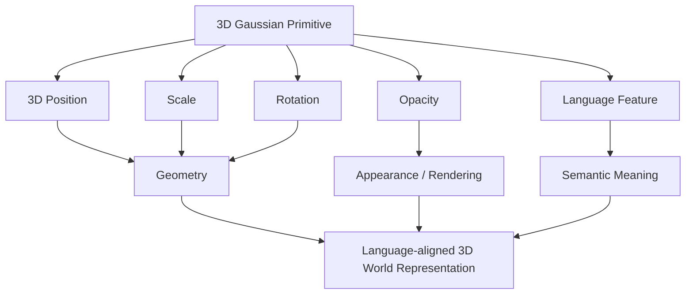
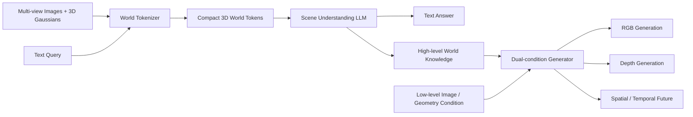
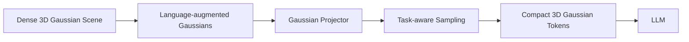
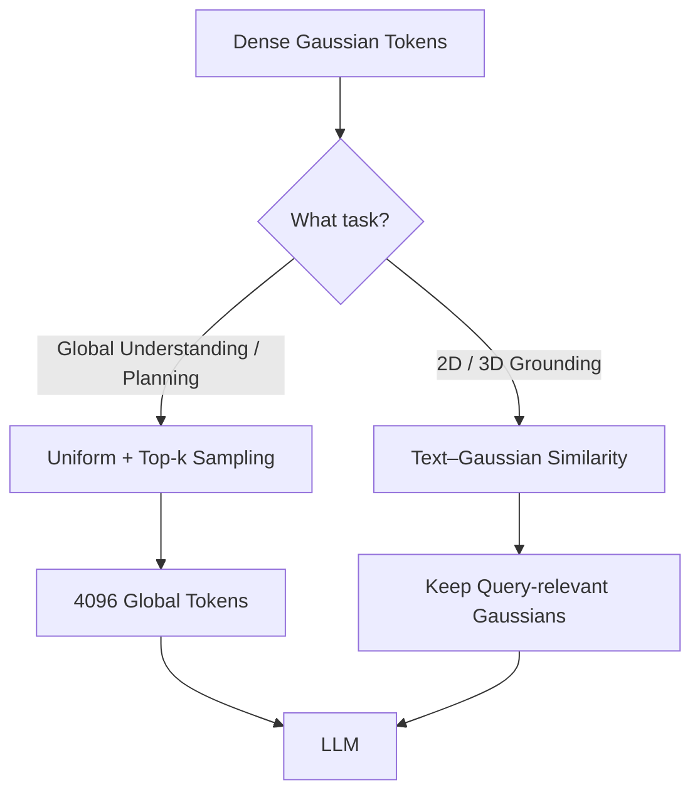
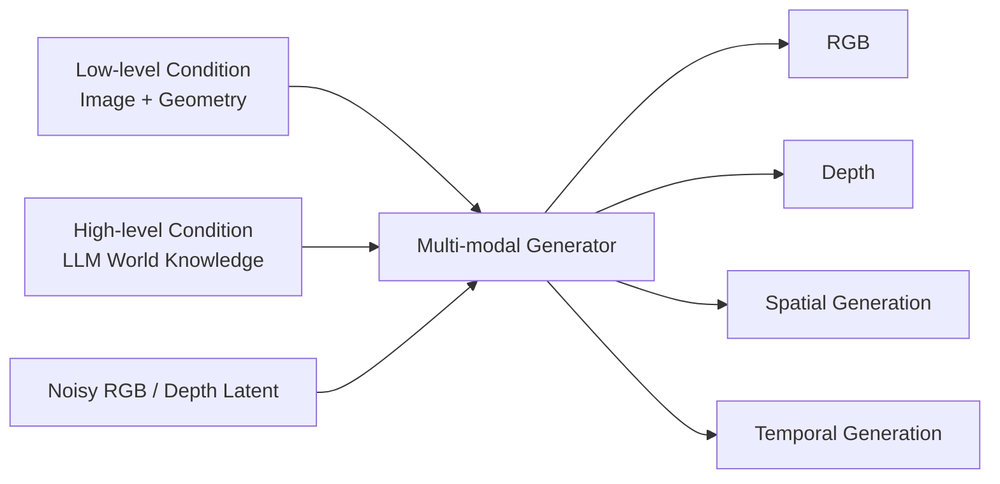
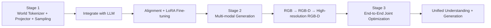
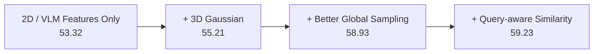
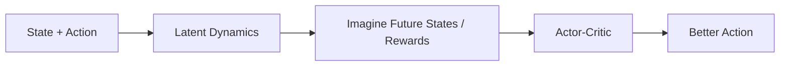
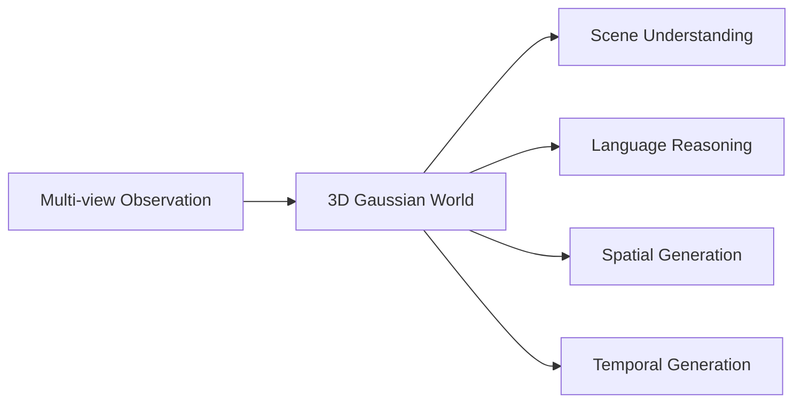

> **Paper:** Tianchen Deng et al., *GaussianDWM: 3D Gaussian Driving World Model for Unified Scene Understanding and Multi-Modal Generation*  
> **Venue:** CVPR 2026, pp. 10656–10667  
> **arXiv:** [2512.23180](https://arxiv.org/abs/2512.23180)  
> **CVPR:** [Open Access](https://openaccess.thecvf.com/content/CVPR2026/html/Deng_GaussianDWM_3D_Gaussian_Driving_World_Model_for_Unified_Scene_Understanding_CVPR_2026_paper.html)  
> **Code:** [dtc111111/GaussianDWM](https://github.com/dtc111111/GaussianDWM)

前面读 DreamerV3 时，我们看到的 World Model 是：

> **学习环境 dynamics，然后在 latent world 中想象未来，用 imagined trajectories 训练 Actor-Critic。**

GaussianDWM 虽然同样叫 **World Model**，但它走的是另一条路线。

它更关心：

> **能不能构建一个显式的三维世界表示，让模型不仅可以生成未来，还能够真正理解“场景里有什么、在哪里、应该怎么描述和规划”？**

所以这篇论文最核心的关键词不是 RL，而是：

> **3D Gaussian + Language + Scene Understanding + Multi-Modal Generation**

传统 Driving World Model 更偏向“预测未来画面”，而 GaussianDWM 进一步把目标扩展到显式 3D scene understanding、language reasoning 和 multi-modal generation。

如果只用一句话概括 GaussianDWM：

> **把语言增强的 3D Gaussian 作为统一 World Representation，让同一个世界模型既可以回答驾驶场景问题，也可以生成空间变化和未来时刻的 RGB-D 场景。**

---

## 1. GaussianDWM 到底想解决什么问题？

很多 Driving World Model 的核心任务是：

```text
Current Driving Scene
→ Future Video / Image / Point Cloud
```

例如预测：

- 车辆继续向前后画面会怎样变化；
- 自车移动以后新的视角是什么；
- 一两秒后的街景会是什么样。

这些模型在 **generation** 上越来越强，但论文认为还有一个明显问题：

> **会生成未来，不等于真正理解三维世界。**

一个驾驶系统不仅需要生成：

> “未来长什么样？”

还需要回答：

- 前方有哪些车？
- 某个目标的 3D 位置在哪里？
- 这个目标未来会怎样运动？
- ego vehicle 应该怎么走？
- 不同 camera view 中的目标是不是同一个物体？

因此 GaussianDWM 想把两个长期相对独立的方向统一：

因此 GaussianDWM 想统一两件事：一边做 **Scene Understanding**，一边做 **Scene Generation**，并让两者共享同一套 3D world representation。

这也是论文标题里：

> **Unified Scene Understanding and Multi-Modal Generation**

真正的含义。

---

## 2. 为什么是 3D Gaussian，而不是 BEV 或 Point Cloud？

在 GaussianDWM 之前，很多驾驶 VLM / World Model 会把三维信息表示成：

```text
BEV Features
Point Clouds
Depth Features
```

然后再把这些特征投影到语言模型的 embedding space。

问题是：

> **这种对齐通常仍然停留在 feature-level，语言语义与真实三维空间之间缺乏显式对应。**

GaussianDWM 的核心选择是 **3D Gaussian Splatting（3DGS）**。

一个 Gaussian primitive 本身带有明确的三维属性：

$$
G_i=(x_i,o_i,s_i,r_i,f_i),
$$

其中可以粗略理解为：

- $x_i$：3D position；
- $o_i$：opacity；
- $s_i$：scale；
- $r_i$：rotation；
- $f_i$：language / semantic feature。

最重要的是最后一个：

> **GaussianDWM 不只给 Gaussian 存 geometry 和 appearance，还把语言特征直接嵌入每一个 Gaussian primitive。**

于是：



这一步非常重要。

它让“某个文本概念”和“真实三维空间中的 Gaussian”之间建立更加直接的 correspondence。

---

## 3. 一张图看懂 GaussianDWM


*GaussianDWM 的整体框架。图片来自 arXiv HTML 版论文 Figure 2。*

整篇论文其实可以拆成三个模块：



对应论文三部分：

1. **World Tokenizer**
2. **Scene Understanding**
3. **Multi-modal Scene Generation**

其中真正把整个系统串起来的是：

> **World Knowledge**

理解模块不仅输出答案，还提取一个高层语言条件，继续指导后面的生成模型。

这也是 GaussianDWM 相比“一个 VLM + 一个独立视频生成器”更有意思的地方。

---

## 4. World Tokenizer：把真实三维世界变成 LLM 能读的 Token

这是整篇论文最值得理解的模块。

原始驾驶场景中的 3D Gaussians 非常多。

一个场景可能包含：

> **几十万级 Gaussian primitives**

如果全部直接塞给 LLM：

```text
hundreds of thousands of Gaussians
→ hundreds of thousands of tokens
→ impossible
```

所以 GaussianDWM 首先需要解决：

> **如何把一个稠密的 3D Gaussian World 压缩成少量但有用的 World Tokens？**

整个过程是：



这就是论文所谓的：

> **World Tokenizer**

---

## 5. Language-Augmented Gaussian：先把语言放进 3D 世界

作者基于 **LangSplat** 构建 3D Gaussian language field。

语言特征来自：

```text
SAM
↓
CLIP Semantic Features
↓
3D Gaussian Language Features
```

论文还做了一个很实际的压缩。

原始 CLIP feature：

$$
D=512.
$$

通过 scene-wise language autoencoder 压到：

$$
d=3.
$$

之后再通过 decoder 恢复到 CLIP feature space。

这说明作者面对的一个实际问题是：

> **3D Gaussian 数量极多，即使每个 Gaussian 只多存一点语义特征，总 memory 也会迅速膨胀。**

因此这一步同时实现：

作者把 512 维 CLIP semantic feature 通过 scene-wise language autoencoder 压缩到 3 维后存入 Gaussian primitive，再通过 decoder 恢复语义表示，以显著降低 dense 3DGS 的 memory cost。

这里的“3D”指的是 **3-dimensional feature vector**，不是“三维空间”本身。

这是阅读论文时比较容易混淆的一点。

---

## 6. Gaussian Projector：Geometry + Appearance + Semantics 进入统一空间

仅仅把 language feature 放进 Gaussian 还不够。

LLM 需要的仍然是统一维度的 Token。

所以对于每个 Gaussian：

$$
G_i=(x_i,o_i,s_i,r_i,f_i),
$$

作者分别编码：

- position；
- opacity；
- scale；
- rotation；
- semantic feature。

其中 3D position 会先使用 Fourier embedding，论文设置：

$$
L=10.
$$

然后不同属性经过各自的 MLP projector，被映射到统一的 **4096-dimensional feature space**。

最后利用可学习权重融合成一个 Gaussian token：

$$
\mathcal G_i
=
\sum_p \alpha_p h_i^p.
$$

快速理解时不用记公式，记住这件事就够了：

最终，每个 Gaussian 的 position、opacity、scale、rotation 和 semantic feature 分别投影后融合成统一 Gaussian Token，再送入 LLM feature space。

所以一个 Gaussian Token 不只是：

> “这里有一个三维点。”

而更接近：

> **“这里有一个具有位置、大小、朝向、可见性和语义信息的三维场景 primitive。”**

---

## 7. Task-Aware Sampling：不是所有 Gaussian 都值得给 LLM 看

这是我认为论文第二个非常漂亮的设计。

即使完成 Gaussian Tokenization，场景中的 Gaussian 数量仍然太大。

所以作者不固定使用一种 sampling，而是根据任务来决定：

> **LLM 到底需要看全局，还是只需要看某一小块区域？**

### Scene Understanding / Planning

对于需要全局理解的任务：

```text
scene caption
region description
planning
```

需要保留整体场景结构。

作者使用：

> **Uniform Sampling + Top-k Sampling**

最终从大量 Gaussians 中选择：

$$
N=4096
$$

个 token 给 LLM。

### 2D / 3D Visual Grounding

如果问题是：

> “后方相机里这辆车的 3D bounding box 是什么？”

真正有价值的是和这个 query 相关的 Gaussian。

因此进一步加入：

> **Language-Guided Similarity Sampling**



这其实和现代大模型里的 **Token Pruning / Query-conditioned Retrieval** 很像。

区别是：

> **这里被检索的不是文本 chunk，而是真实三维世界中的 Gaussian primitives。**

---

## 8. Scene Understanding：让 LLM 直接“读”三维世界

Gaussian tokens 与 text tokens 进入 LLM。

论文最终使用：

> **Qwen3-8B**

作为语言模型。

LLM 输出两类东西：

Qwen3-8B 同时输出文本答案和高层 World Knowledge feature；前者用于理解任务，后者继续作为 scene generation 的高层条件。

这里第二个输出尤其重要。

LLM 不只是回答：

> “前面有几辆车？”

它内部提取出的高层世界知识还会继续传给 generation module。

这让：

```text
Understanding
```

和：

```text
Generation
```

真正发生了信息交互。

---

## 9. 它到底理解哪些 Driving Task？

论文在 NuInteract 上主要测试四类场景理解任务：

| Task | 模型需要做什么 |
| --- | --- |
| RD&P | Region Description & Perception |
| 2D VG | 在图像中找到 query 对应目标 |
| 3D VG | 给出目标的三维空间位置 |
| Planning | 根据当前场景判断 ego vehicle 行为 |

例如：

```text
How should the ego car proceed?
→ Go Straight
```

或者：

```text
Find all cars in CAM_BACK
and provide their 3D bounding boxes.
```

论文中的定性结果非常直观：


*GaussianDWM 同时进行 2D/3D grounding、场景问答、规划以及 RGB-D 空间/时间生成。图片来自 arXiv HTML 版论文 Figure 3。*

这张图其实非常适合概括论文：

> **同一个 3D Gaussian World 既能被“问问题”，也能被“向未来生成”。**

---

## 10. Multi-Modal Generation：为什么还需要 Language Condition？

如果只想生成未来场景，传统方法可以直接使用：

```text
image
+
geometry / point cloud
+
camera pose
```

作为生成条件。

GaussianDWM 认为这仍然不够。

因为这些条件告诉生成器：

> **像素和几何应该在哪里。**

但并没有显式告诉它：

> **这个世界正在发生什么。**

所以论文提出 **Dual-Condition Generation**：



可以把两个 condition 的职责理解为：

### Low-level Condition

负责：

- texture；
- local geometry；
- image style；
- precise spatial constraint。

### High-level World Knowledge

负责：

- semantic context；
- object relationships；
- scene-level reasoning；
- temporal intent / trajectory information。

这就是论文所谓：

> **high-level world knowledge + low-level image condition**

联合指导生成。

---

## 11. Spatial Generation 与 Temporal Generation 是两件不同的事

GaussianDWM 同时支持两种“未来”。

### Spatial Generation

不是时间变化，而是：

> **如果 camera / ego position 改变，场景应该长什么样？**

论文测试 novel-view synthesis，例如：

```text
±1 m
±2 m
±4 m
```

的 viewpoint shifts。

### Temporal Generation

是真正的：

> **1 秒或 2 秒以后，场景会怎样变化？**

论文方法部分支持：

```text
+1 s
+2 s
```

未来预测。

整个区别可以表示成：

因此，Spatial Generation 回答“换一个位置会看到什么”，Temporal Generation 回答“过一段时间世界会变成什么样”。

这也是为什么 3D scene representation 很重要：

> **Spatial generation 需要 geometry，Temporal generation 又需要 world semantics 和 motion context。**

---

## 12. 训练不是一次完成，而是三阶段

论文使用一个比较典型的模块化训练流程：



Scene Understanding 部分又包含：

### Alignment Stage

冻结整个 VLM，训练 aligner：

```text
5k warm-up steps
```

### LLM Adaptation

再通过：

```text
LoRA
30k steps
```

适配 LLM。

论文的第一阶段模型训练使用 **16 NVIDIA A100 GPUs**。

Generation 部分则逐步从：

```text
224 × 400 RGB
↓
224 × 400 RGB-D
↓
424 × 800 RGB-D
```

训练到高分辨率生成，并使用 rectified-flow / v-prediction 目标。

---

## 13. 实验：3D Gaussian 对 Scene Understanding 到底有没有帮助？

在 NuInteract 上，GaussianDWM 的总体平均分：

| Model | Avg. |
| --- | ---: |
| InternVL2-8B | 45.42 |
| DriveMonkey | 52.12 |
| **GaussianDWM** | **59.23** |

论文报告相对前一个 SOTA 的平均提升约 **13.6%**。

更有价值的是 ablation：

| Setting | Avg. |
| --- | ---: |
| Fine-tuned, no Gaussian | 53.32 |
| + Gaussian, Random Sampling | 55.21 |
| + Top-k + Uniform | 58.93 |
| **+ Similarity Sampling** | **59.23** |

这个结果非常清楚：



也就是说，性能提升并不只来自：

> “多塞一种 3D feature。”

更关键的是：

1. 显式 3D Gaussian representation；
2. 合理的 token selection；
3. query-conditioned semantic sampling。

---

## 14. Scene Generation：高层 World Knowledge 真的有用吗？

GaussianDWM 在 nuScenes 上测试 RGB-D novel-view synthesis。

论文 Table 3 中：

| Method | FID ±1m ↓ | FVD ±1m ↓ | FID ±2m ↓ | FVD ±2m ↓ |
| --- | ---: | ---: | ---: | ---: |
| StreetGaussian | 32.12 | 153.45 | 43.24 | 256.91 |
| OmniRe | 31.48 | 152.01 | 43.31 | 254.52 |
| DiST-S | 10.12 | 45.14 | 12.97 | 68.80 |
| **GaussianDWM** | **8.36** | **44.50** | **11.27** | **68.17** |

在 $\pm1$m 和 $\pm2$m shift 下，GaussianDWM 的结果非常强。

论文还测试了 $\pm4$m：

```text
GaussianDWM: FID 18.81 / FVD 116.40
DiST-S:     FID 17.57 / FVD 105.29
```

这里有一个值得注意的小细节：

> **论文正文声称在 extreme viewpoint shifts 下整体优于已有方法，但 v3 Table 3 中 $\pm4$m 的 FID/FVD 数值实际上是 DiST-S 更低。**

所以更稳妥的结论是：

> **GaussianDWM 在较大的 novel-view shift 下保持很强的生成质量，尤其在 $\pm1$m / $\pm2$m 上达到表中最佳结果；但不能简单概括成每一个 shift 和指标都绝对第一。**

这类表格细节比只看论文摘要更值得注意。

---

## 15. 这篇论文真正重要的不是“3DGS + LLM”

如果只把 GaussianDWM 理解成：

> **“把 3D Gaussian 接到 Qwen 前面。”**

其实会低估它。

真正的逻辑是：

GaussianDWM 真正形成的是一条 **Represent the World → Understand the World → Use Understanding to Generate the World** 的闭合信息链。

它试图构建的是一个闭合的信息链：

> **Represent the World → Understand the World → Use Understanding to Generate the World**

所以“Understanding”和“Generation”不是两个独立任务。

理解模块得到的 World Knowledge 会反过来帮助 generation。

这才是论文里 **Unified World Model** 更核心的地方。

---

## 16. GaussianDWM 和 DreamerV3 都叫 World Model，但完全不是一类东西

这一点非常值得放到一起理解。

### DreamerV3：Decision-centric World Model

DreamerV3 的核心是：



它真正关心：

> **如果我采取这个动作，未来会发生什么？**

World Model 的最终目标是 **Decision Making**。

---

### GaussianDWM：Representation / Generation-centric World Model

GaussianDWM 的核心更接近：



它真正关心：

> **世界是什么、在哪里、如何理解，以及未来视觉场景会怎样变化？**

所以可以这样区分：

| | DreamerV3 | GaussianDWM |
| --- | --- | --- |
| World Representation | Latent RSSM | **Explicit 3D Gaussian** |
| Action-conditioned Dynamics | **核心** | 非核心 |
| Future Prediction | Latent state / reward | **RGB-D Scene** |
| Policy Learning | **Actor-Critic** | 无直接 RL policy |
| Language Understanding | 无 | **LLM / Qwen3-8B** |
| 3D Scene Grounding | 非核心 | **核心** |
| Main Goal | Decision | **Understanding + Generation** |

所以 GaussianDWM 不能简单理解成：

> “自动驾驶版 DreamerV3。”

它属于另一类 World Model。

---

## 17. GaussianDWM 的边界也很明显

这篇论文非常有意思，但需要看清几个边界。

### 第一，它还不是闭环 Driving Policy

GaussianDWM 可以：

- scene understanding；
- planning QA；
- trajectory prediction；
- scene generation。

但论文核心没有像 DreamerV3 那样：

> **在 World Model 内 imagined rollout，再直接优化驾驶 Policy。**

因此它更接近：

> **World Representation + Understanding + Generation**

而不是完整的：

> **World Model + Decision Learning**

---

### 第二，3D Gaussian 仍然很重

一个场景可以有几十万 Gaussian。

论文之所以要专门设计：

```text
Top-k
Uniform Sampling
Similarity Sampling
```

本身就说明：

> **Explicit 3D World Representation 的代价是 token 数量和 memory 都非常大。**

因此 World Tokenizer 的效率会成为这条路线非常重要的问题。

---

### 第三，当前验证仍集中在 Driving Domain

主要实验仍然是：

```text
nuScenes
NuInteract
```

所以现在不能直接推断：

> “同一种 Gaussian World Tokenizer 可以无缝迁移到机器人操作、UAV 或通用具身环境。”

但这个方向本身非常值得继续研究。

---

## 18. 开源代码和数据：这篇论文为什么比较适合继续做？

截至 CVPR release，官方仓库已经开放：

- QA chain；
- world-generation chain；
- model weights；
- GaussianDWM dataset。

仓库整理的数据规模约：

```text
~1.9M training samples
~358K test samples
```

内容覆盖：

- NuInteract QA；
- 2D / 3D visual grounding；
- scene caption；
- planning；
- trajectory prediction；
- OmniDrive VQA / conversation。

需要注意：

> **当前 CVPR release package 并不是论文与后续扩展的所有代码。**

官方 README 明确说明，目前 release 不包含：

- trajectory code；
- VGGDrive journal extensions；
- ViT-feature Gaussian variants；
- attention-based Gaussian selection。

因此如果目标是完整复现所有潜在扩展，需要区分：

> **CVPR paper release**

和：

> **后续 journal / internal extensions**

---

## 最后，用一句话理解 GaussianDWM

DreamerV3 告诉我们：

> **可以学习一个 latent dynamics model，在模型内部想象未来并学习决策。**

GaussianDWM 则展示了另一种 World Model：

> **把 geometry、appearance 和 language semantics 直接组织成一个显式 3D Gaussian World，再让这个世界表示同时支持理解、grounding、planning 和 RGB-D 时空生成。**

整篇论文最后可以压缩成：

最终可以把整篇论文压缩成：**Multi-view World → Language-aligned 3D Gaussians → Task-aware World Tokens → LLM Understanding → High-level World Knowledge + Low-level Geometry → Spatial / Future RGB-D Generation**。

我认为 GaussianDWM 真正值得带走的不是：

> **3D Gaussian Splatting 本身。**

而是一个更大的想法：

> **World Model 不应该只是“预测下一帧”的生成器。一个更完整的 World Model，应该拥有可以被语言查询的三维世界表示，并让 Understanding 和 Generation 共享同一套 World Knowledge。**

这也是它和 DreamerV3 放在同一个 **World Models** 分类下最有价值的原因：

- DreamerV3 在问：**How will the world evolve under actions?**
- GaussianDWM 在问：**How should the world be represented so that it can be both understood and generated?**

而更进一步的方向，自然就是：

> **3D World Representation + Future Prediction + VLA / Policy Learning**

也就是让机器人或自动驾驶系统不仅“看懂世界”和“生成世界”，还能够基于预测出来的未来真正做出闭环决策。
